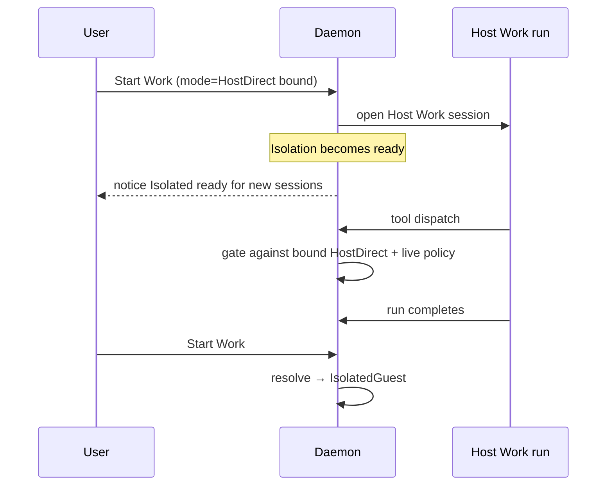
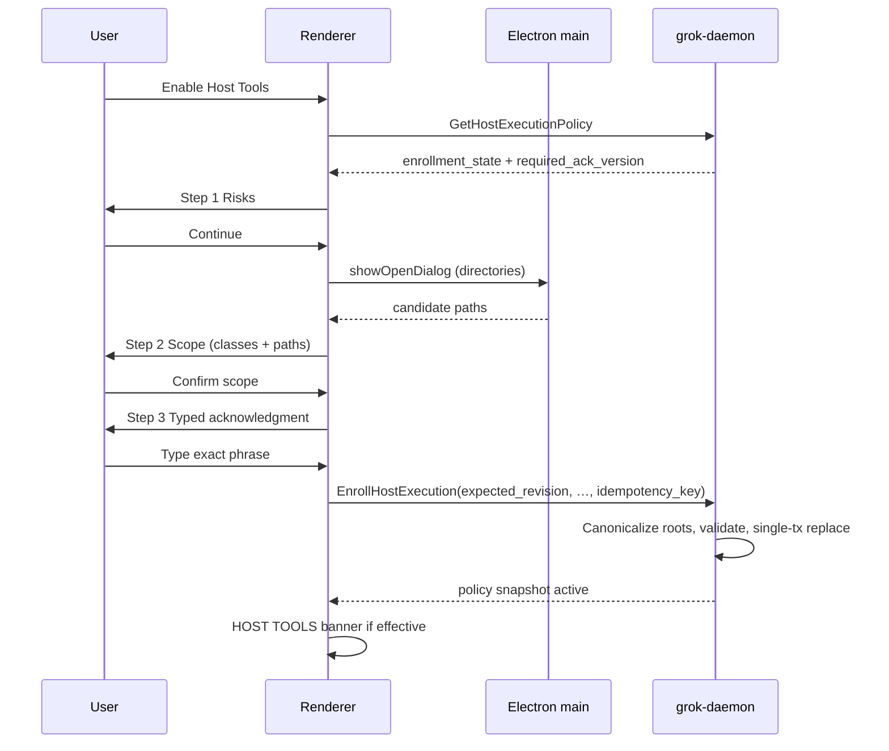
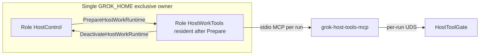

# Dual-mode Work execution: Host Tools (opt-in) + Isolated Guest Work

| Field | Value |
|-------|-------|
| **Author** | Grok Desktop engineering (draft owner: systems architect) |
| **Date** | 2026-07-13 |
| **Status** | Design approved (revision 5) — ready for PR 1 implementation |
| **Supersedes / amends** | ADR 0003 (partial), ADR 0004 (Work readiness wording), AGENTS.md isolation wording, `docs/architecture/principles.md`, `docs/quality/linux-ga.md` Limited Mode + host-ACP rules, `docs/platform/threat-model.md`, `docs/research/official-grok-surfaces.md` capability routing, capability resolution in `CapabilityResolver` |
| **Proposed ADR** | [`docs/decisions/0032-dual-mode-work-execution.md`](../decisions/0032-dual-mode-work-execution.md) (next after 0031) |
| **IPC impact** | Protocol epoch **25** (current is **24** in `crates/grok-protocol` / `DaemonRpcClient.ts`) |
| **Schema impact** | SQLCipher schema **25** (current latest **24** in `crates/grok-sqlcipher/src/schema.rs`) |

---

## Overview

Grok Desktop today fails closed into **Limited Mode** whenever a qualified isolation backend (Windows HCS utility VM or Linux QEMU/KVM broker + signed guest) is absent. That invariant is correct for strong isolation, but it leaves users without local filesystem, shell, or MCP-class productivity until guest images and brokers ship—an external gate documented in `docs/plan/06-open-risks-and-external-gates.md` and `docs/quality/linux-ga.md`.

This design introduces a **long-term dual-mode product model**:

1. **Isolated Work** — the existing secure target: tools run only inside a signed utility guest behind the privileged broker (`IsolationRuntime`, `PrivilegedGateway`, guest ACP via `GrokAcpExecutionBoundary::IsolatedGuest`).
2. **Host Tools** — an **explicit, risk-aware, revocable** opt-in that allows a bounded set of Work tools to execute on the real host under daemon-owned policy, approvals, and path allowlists, driven by a **daemon-mediated Host Tools MCP** consumed by a **permission-brokered host Work ACP session** (see § Host Tools agent/runtime model).

Host Tools is **not** a silent compatibility fallback. Guest failure, missing images, or unqualified probes **never** auto-enable host execution. Limited Mode remains the default when neither Isolated Work is ready **nor** Host Tools is durably enrolled **and** the Host Work runtime can be composed.

**Isolated Work remains the only path that satisfies the strong-isolation full-product GA bar** (linux-ga / Windows HCS qualification). Host Tools is a **risk-accepted product mode** that does not substitute for isolation qualification.

---

## Background & Motivation

### Current state

Capability truth is daemon-owned ([ADR 0004](../../docs/decisions/0004-daemon-owned-credentials-and-capabilities.md)). `CapabilityResolver` in `crates/grok-application/src/capabilities.rs` gates Work / Shell / MCP exclusively on:

```text
work_ready = subscription_authenticated && strong_isolation_ready
```

When `ready` is true, `status()` **always** sets `reason_code = "ready"` and `reason = "Available."` — Available backends must not overload `reason_code`.

`IsolationRuntime` (`crates/grok-application/src/isolation_runtime.rs`) sets `strong_isolation_ready` only when the broker probe succeeds **and** a journaled `runner.health` guest-control call succeeds under PoP. Failures clear readiness; comments explicitly forbid host-exec fallback.

Official surface and ACP reality (must not be ignored):

| Fact | Location |
|------|----------|
| Host ACP is **auth/control only**; adapter rejects host `open_session` / prompt | `docs/research/official-grok-surfaces.md` § Mandatory controls; `GrokAcpRuntime::require_guest_execution`; `GrokAcpExecutionBoundary::{HostControl, IsolatedGuest}` |
| Files/shell/local MCP routed **Guest ACP only** today | official-surfaces capability table |
| `HostPermissionChannel` delivers ACP permission requests to the daemon for Allow/Reject | `crates/grok-acp/src/permission.rs` |
| `AgentRuntime` is session/prompt/cancel oriented; tools appear as `AgentToolCall` events | `crates/grok-application/src/agent_runtime.rs` |
| `ApprovalService` / `SideEffectService` exist; no host tool dispatch pipeline yet | `approvals.rs`, `effects.rs` |
| Runtime gating is **facts-based** in `CapabilityResolver`; domain `CapabilityRequirement.requires_strong_isolation` is static metadata, not the live gate | `capability.rs`, `capabilities.rs` |
| MCP unavailable reason today | `mcp_sandbox_unavailable` |

Product surfaces reflect Limited Mode:

| Layer | Behavior today |
|-------|----------------|
| Application | `CapabilityFacts.strong_isolation_ready`; no host-execution fact |
| Daemon | `handler.rs` `capability_facts()` refreshes isolation; ignores caller-supplied readiness |
| Desktop | `limitedMode: !workAvailable` in `electronDesktopClient.ts`; AppShell “Limited mode” |
| Docs | ADR 0003, AGENTS.md, linux-ga: no host-exec fallback |

### Pain points

1. **Competitiveness gap**: peers offer host filesystem and shell immediately.
2. **Binary degradation**: only “full isolation” or “no tools.”
3. **Silent-fallback temptation**: must be forbidden structurally.
4. **Execution architecture gap**: enabling `Capability::Work` without defining who runs tools either violates host-ACP auth-only or ships a dead capability.

---

## Goals & Non-Goals

### Goals

1. Three stable product states: **Limited Mode**, **Host Tools**, **Isolated Work**.
2. **Conscious risk enrollment** before any host tool execution.
3. A concrete **Host Tools agent/runtime model** that maps Grok Build Work sessions → policy → approvals → host ops without silent guest fallback.
4. Parallel backends behind one product UI, with **dedicated `work_execution_mode` projection** (not overloaded `reason_code`).
5. Structural non-inheritance: Chat and scheduled automations cannot dispatch Host tools.
6. Daemon authority: policy, path validation, approvals, effect journaling, secrets.
7. Incremental PRs with **no-silent-fallback tests early** and **execution bridge before FS tools**.

### Non-Goals

1. Not replacing Isolated Work as the security-recommended / GA-isolation path.
2. Not host computer-use in v1.
3. Not arbitrary `npx` / unvetted MCP installers in v1.
4. Not auto-enabling Host on guest failure or first install.
5. Not elevating the Electron renderer to execute tools.
6. Not changing SuperGrok / BYOK / Grok Build **auth** boundaries (host ACP **authenticate** remains the subscription path).
7. Not treating bubblewrap/seccomp-on-host as Isolated Work.
8. Not BYOK-only Host Work branded as SubscriptionAcp (see Key Decision: subscription required).

---

## Proposed Design

### A. Product model (three states)

#### Canonical naming

| Product name (UI/docs) | Internal enum (**new** domain type) | Meaning |
|------------------------|-------------------------------------|---------|
| **Limited Mode** | `WorkExecutionMode::Limited` | Default. Work-class tools unavailable. |
| **Host Tools** | `WorkExecutionMode::HostDirect` | User-enrolled. Tools run on host via Host Work runtime + daemon MCP. |
| **Isolated Work** | `WorkExecutionMode::IsolatedGuest` | Isolation facts ready. Tools in utility guest. Recommended. |

`WorkExecutionMode` is **introduced by this design** in `grok-domain` (it does not exist today).

**UI badge / banner:**

- Host effective: `HOST TOOLS` (Clay `--warning` / `--warning-soft` per `DESIGN.md`)
- Isolated effective: `ISOLATED WORK`
- Limited: existing “Limited mode” connection plan when daemon online but Work unavailable — **not** used when Host is effective; **not** confused with daemon offline (“Connecting” / degraded remains connectivity-only)

#### Mode selection priority

```text
// Single definition — see also host_work_runtime_ready() below. No alternate branches.
fn resolve_mode(facts, policy, flag) -> WorkExecutionMode {
  if facts.strong_isolation_ready && facts.subscription_authenticated {
    return IsolatedGuest;  // preempts Host
  }
  if flag.enabled
     && policy.is_effectively_active(now, daemon_boot_id)
     && facts.subscription_authenticated
     && facts.host_work_runtime_ready
  {
    return HostDirect;
  }
  Limited
}
```

Rules:

1. **Isolated preempts Host** when isolation + subscription ready. Stored Host enrollment may remain; it is not the effective backend.
2. Isolation loss → Host **only if** Host still effectively enrolled **and** `host_work_runtime_ready`; never auto-enroll.
3. Renderer cannot select mode.
4. **Subscription is required for Host Tools Work** (Key Decision; closed). BYOK never unlocks Host Work / Shell.
5. **Enrollment alone never yields HostDirect.** After enroll, mode stays Limited until `PrepareHostWorkRuntime` succeeds (see bootstrap).
6. **`StartWorkRun` requires** `resolve_mode() == HostDirect | IsolatedGuest` — never bootstraps runtime as a side effect of starting a prompt.

#### Capability availability mapping

| Capability | Isolated path | Host path (v1) | Limited |
|------------|---------------|----------------|---------|
| Work | `subscription && strong_isolation_ready` | `subscription && host_policy_effective && host_work_runtime_ready` | Unavailable |
| Shell | same as Work | `host_policy.tool_process_exec` (+ Work host path) | Unavailable |
| Mcp | `strong_isolation_ready` (reason `mcp_sandbox_unavailable` when not) | deferred: Unavailable with `mcp_sandbox_unavailable` until Host MCP PR; then policy `tool_mcp` | Unavailable |
| BrowserAutomation / ComputerUse | isolation + respective facts | **Unavailable** | Unavailable |

**Projection rules:**

- When Available: keep `reason_code = "ready"` and human `reason` describing **where** tools run (string only; not a branch key).
- Backend discrimination uses dedicated IPC fields: `work_execution_mode` + `HostExecutionPolicySnapshot` — **never** Available-time reason codes like `work_backend_host`.
- New **Unavailable** reason codes only:
  - `host_tools_not_enrolled`
  - `host_tools_policy_expired`
  - `host_tools_revoked`
  - `host_tools_feature_disabled`
  - `host_tools_runtime_not_prepared` — enrolled + HostControl authenticated, but `PrepareHostWorkRuntime` not yet succeeded this daemon lifetime (or deactivated and not re-prepared)
  - `host_tools_runtime_unavailable` — helper/package/IPC factory missing or HostWorkTools cannot compose
  - `host_tools_auth_resume_failed` — prepare/role switch: non-interactive authenticate failed
  - `host_tools_runtime_busy` — role mutex / switch blocked (e.g. Setup auth while Host Work owns home)
  - existing: `work_execution_unavailable`, `subscription_session_unavailable`, `strong_isolation_unavailable`, `mcp_sandbox_unavailable`

**Advertising rule:** Work Available on Host **if and only if** `host_work_runtime_ready` (single definition below). Enrollment without prepare → Unavailable `host_tools_runtime_not_prepared` with CTA **Prepare Host Tools runtime**.

#### Mid-run mode evaluation and isolation flap (Issue 4)

| Evaluation point | Behavior |
|------------------|----------|
| Capability snapshot / UI refresh | Recompute effective mode from live isolation + policy |
| **New** Work run start | Bind `run.execution_mode` durably to resolved mode at start; refuse start if Limited |
| **Every host tool dispatch** | Re-check: policy still effective, feature flag on, run’s bound mode still allowed. Deny with stable reason if not |
| Isolation becomes ready mid Host run | **Sticky run mode**: in-flight Host run keeps `HostDirect` until terminal (durable `runs.execution_mode`); **new** runs become Isolated. **Chrome:** while any non-terminal run is Host-bound, keep **HOST TOOLS** warning chrome even if global effective mode is Isolated (see § Persistent indicator). Notice: “Isolated Work is ready — new sessions use the protected guest. This session still runs on this computer.” |
| Isolation lost mid Isolated run | Existing isolation/interrupt paths; do **not** migrate the run to Host mid-flight. New runs may use Host if enrolled |
| Policy revoked mid Host run | Cancel in-flight tool dispatches; non-idempotent effects → `interrupted_needs_review`; run fails closed |
| Daemon restart mid Host run | Recover bound mode from `runs.execution_mode`; Host-bound interrupted runs stay Host for review — **never** auto-migrate to Isolated |
| Isolation probe thrash | Mode may flip on snapshots; **sticky per-run** prevents tool mid-call backend swap. Metrics: `work_mode_transition_total{from,to}` |



### B. Risk-awareness UX (critical)

#### Entry points

1. **Primary**: Settings → **Work execution** section (daemon-backed; pattern from `SettingsView.tsx`).
2. **Secondary**: When user navigates to Work / Composer Work affordance while Work is Unavailable:
   - Show **blocking setup panel** (full panel in Work route, not toast):  
     - If not subscribed: CTA **Connect Grok Build**  
     - If not enrolled: CTA **Review Host Tools risks** + secondary **About Isolated Work**  
     - If enrolled + subscribed but `host_tools_runtime_not_prepared`: CTA **Prepare Host Tools runtime** (calls `PrepareHostWorkRuntime`)  
     - If `host_tools_auth_resume_failed`: CTA **Reconnect Grok Build** then re-prepare  
   - Composer stays gated on `work.available` for **sending** prompts; the setup panel is how availability is earned (enroll → prepare → Available).
3. **Not** entry points: deep links, first-run default-on, tray toggle without modal, env vars, renderer storage; **not** `StartWorkRun` as bootstrap (no chicken-egg).

#### Enrollment flow (multi-step)

Electron submits non-secret intent; daemon owns durable grant (spirit of ADR 0005).



**Step 1 risks** (structure fixed; legal/product owns final copy):

1. Full user privilege on this computer for allowed tools.
2. Prompt injection from files, pages, tool metadata, or model instructions.
3. No utility-guest boundary (unlike Isolated Work).
4. Exfiltration risk via model/provider traffic under existing network policy.
5. **Approved programs you run with Host Tools can use the network as your user** (no network namespace isolation for child processes in v1 — accepted residual).
6. Supply chain risk if additional MCP is later enabled.
7. You can revoke Host Tools anytime; new host tool dispatch stops immediately.

Footer: Isolated Work is recommended when available; Host Tools is optional productivity.

**Step 2 scope:**

- Path roots via **main-process folder chooser**; daemon re-canonicalizes and may reject (see enroll errors).
- Tool classes: v1 `fs_read`, `fs_write`, `process_exec` (MCP enrollable only when Host MCP ships).
- Session-bound vs durable expiry.
- **Max-breadth confirm** (mandatory UX **and** daemon gate): if any root is filesystem root (`/` or drive root `X:\`) or the user’s home directory, UI requires checkbox “I am granting access to my entire home/drive” **and** enroll request must set `max_breadth_acknowledged = true` (included in request fingerprint). Daemon **rejects** broad roots when the flag is false (`InvalidInput` / `host_tools_max_breadth_required`). UI-only check is never sufficient.

**Step 3 typed acknowledgment:**

- Exact phrase for `HOST_ACKNOWLEDGMENT_VERSION` (English v1 constant in domain; see Open Questions for localization).
- Primary button disabled until match; no “Don’t show again.”

#### UX state matrix (Issue 9)

| enrollment_state | effective mode | subscription | isolation | UI |
|------------------|----------------|--------------|-----------|-----|
| `disabled` | Limited | any | no | Settings: Enable CTA; Work setup panel; no Host banner |
| `disabled` | Limited | no | no | Setup: connect subscription first |
| `active`, runtime prepared | HostDirect | yes | no | Banner HOST TOOLS; badge HOST; Composer Work enabled; Settings: **Host runtime ready** + Deactivate |
| `active`, not prepared | Limited | yes | no | No Host warning banner; Settings/Work: **Prepare Host Tools runtime**; reason `host_tools_runtime_not_prepared` |
| `active` | IsolatedGuest | yes | yes | Badge ISOLATED; Settings: Host enrollment “saved, not active (Isolated preferred)”. If Host-bound run still live → HOST TOOLS warning (chrome derivation) |
| `active` + sticky Host run | IsolatedGuest (global) | yes | yes | Banner: **HOST TOOLS — active session on this computer**; dual plan string |
| `expired` / `needs_reconsent` | Limited | yes | no | Settings: Re-enable; Work Unavailable |
| `active` + feature flag off | Limited | yes | no | reason `host_tools_feature_disabled` |
| any | Limited | yes | no | Plan “Limited mode” only when Host not effective **and** no Host-bound active run |
| daemon offline | n/a | n/a | n/a | Plan “Connecting” / degraded — **never** show HOST badge |

**Enroll error mapping (daemon → UI):**

| Daemon error | UI |
|--------------|-----|
| phrase mismatch / wrong ack version | Inline field error; stay on step 3 |
| `expected_revision` conflict | Refresh policy; toast “Settings changed; try again” |
| root missing / not directory | Highlight path; “Choose another folder” |
| root is symlink that escapes or is denied private dir | “This folder can’t be used” |
| empty tool classes | Disable Continue on step 2 |
| `host_tools_max_breadth_required` | Highlight roots; force max-breadth checkbox + re-submit |
| feature disabled | Block enroll; explain |

**Folder picker:** Electron main `dialog.showOpenDialog({ properties: ['openDirectory'] })` only supplies **candidates**. Daemon `EnrollHostExecution` is authoritative: exists, is directory, canonicalize, reject reparse-escape, reject daemon private paths (DB, vault, guest images, integration staging).

**Typed phrase / IME:** v1 ships a single exact Unicode NFC-normalized English phrase; comparison is exact after NFC. Localization of the **required typed string** is deferred (Open Question); UI chrome may be localized without changing the typed constant until a new ack version.

**Banner a11y:** `role="status"` + `aria-live="polite"` for appearance; Disable control is a real `<button>`; warning colors meet DESIGN.md contrast notes for Clay on soft surfaces.

#### Persistent indicator (chrome derivation)

Shell chrome must **not** show pure Isolated branding while host privilege remains live on any run.

```text
display_host_warning =
  effective_mode == HostDirect
  OR exists non-terminal run with bound execution_mode == HostDirect

display_mode_label =
  if display_host_warning && effective_mode == IsolatedGuest:
      "Isolated Work — Host session active"
  elif effective_mode == HostDirect: "Host Tools"
  elif effective_mode == IsolatedGuest: "Isolated Work"
  else: "Limited mode"  // only when daemon online and Work unavailable
```

| Condition | Banner | Work badge | Plan string |
|-----------|--------|------------|-------------|
| effective HostDirect | **HOST TOOLS** — tools run on this computer (Settings · Disable) | `HOST` | Host Tools |
| effective Isolated, **no** Host-bound run | none (optional subtle Isolated status) | `ISOLATED` | Isolated Work |
| effective Isolated, **Host-bound run active** | **HOST TOOLS** — active session on this computer; new sessions use Isolated Work | `HOST` (or dual chip) | Isolated Work (Host session active) |
| daemon offline | none | none | Connecting / degraded |

**Ongoing risk UX (not only enrollment):**

- Banner whenever `display_host_warning` (not only global effective Host).
- Work **transcript / session header** always shows **bound** mode of the open run (`Host` vs `Isolated`).
- **Every** host tool approval dialog (including Low `fs_read`) restates “Runs on this computer (Host Tools)” when bound mode is Host.
- Settings shows current roots/classes and last acknowledged version.
- Tool cards label `Host` vs `Isolated` from bound mode.

#### Disable / revoke / re-consent

| Event | Re-consent? |
|-------|-------------|
| Same ack version upgrade | No |
| `HOST_ACKNOWLEDGMENT_VERSION` bump | Yes |
| DB wipe | Yes |
| Scope change (any root/class change) | **Full re-enroll** (replace mutation; no delta API) |
| N-day TTL alone | No (default) |
| Isolation loss → Host | No if still enrolled |

Revoke: Settings or banner → single confirm → `RevokeHostExecution(expected_revision)`.

---

### C. Host Tools agent/runtime model (critical — Issue 1)

#### Decision (chosen)

**Permission-brokered host Work ACP sessions + daemon-mediated Host Tools MCP as the only productive tool surface.**

Rationale:

- Today `GrokAcpExecutionBoundary::HostControl` rejects sessions; IsolatedGuest is the only session boundary (`grok-acp/src/runtime.rs`).
- Official research forbids exposing host prompt/tool methods **without** a product amendment; Host Tools **is** that amendment, narrowly scoped.
- Approving agent-native ambient shell without daemon I/O would forfeit moment-of-use path validation.
- A daemon-owned MCP tool server lets every FS/exec op pass `HostExecutionPolicy` → `ApprovalService` → `SideEffect` → `HostDirectBackend` with reparse-at-use.

**Rejected for v1:**

| Option | Why not |
|--------|---------|
| Enable host ACP tools with permission-only broker (agent performs I/O) | Weak path/TOCTOU control; cannot enforce roots at open(2) |
| Non-ACP “local tools” product without Grok Build | Must not set `Capability::Work` / `SubscriptionAcp` |
| Silent guest→host | Forbidden |

#### New ACP execution boundary

```rust
// crates/grok-acp — conceptual amendment
enum GrokAcpExecutionBoundary {
    HostControl,      // auth only (unchanged default)
    HostWorkTools,    // NEW: session/prompt allowed IFF Host Tools effective
    IsolatedGuest,    // existing
}
```

Factory: `GrokAcpConfig::host_work_tools(component, policy_roots, grok_home)` — **only** callable from daemon composition when starting a Host Work run. Unit tests: HostControl still rejects sessions and non-empty workspace roots; HostWorkTools allows session only with non-empty validated roots.

#### Dual ACP runtime composition

Today boundary is fixed at `GrokAcpRuntime::start()`; HostControl **rejects non-empty workspace roots** (`runtime.rs`). Host Work therefore needs a **HostWorkTools** process that can open sessions — **not** a reconfigure-in-place of the HostControl boundary enum alone.

**Code constraint (authoritative):** `GrokHomeSpec::provision` takes an **exclusive** `.runtime.lock` (`GrokHomeError::RuntimeBusy` if another owner holds it — `isolation.rs`). Two simultaneous ACP runtimes **cannot** share one `GROK_HOME` under the current lock model. `GrokBuildAuthService` only stores a **process-local boolean** after `AgentRuntime::authenticate` on whatever runtime it was bound to; it does **not** export transferable credentials over IPC (correct — secrets stay in the component/home).

#### Credential continuity decision (Key Decision)

**Chosen: Option A′ — shared authenticated `GROK_HOME` with exclusive serial ownership + non-interactive resume (Option B fail-closed).**

Not Option C (second interactive OAuth for Host Work) unless resume fails and the user returns to Setup.

| Piece | Rule |
|-------|------|
| Home path | **One** install home: existing HostControl `GrokHomeSpec` / `home_path()` (same `installation_id`). No second “host-work-tools” home for auth. |
| Lock | At most **one** `ProvisionedGrokHome` owner (existing exclusive lock). Role = `HostControl` **or** `HostWorkTools`, never both. |
| Auth materials | Owned by the official Grok Build component **under that single home** after a successful HostControl `authenticate`. Daemon never copies `auth.json` / tokens (product invariant). |
| HostControl role | Default when Host Work runtime is **not** prepared/active: authenticate-only, empty workspace roots (today). |
| Switch → HostWorkTools | **Only via `PrepareHostWorkRuntime`** (or internal re-prepare), **never** as a side effect of `StartWorkRun`. Steps under **role mutex**: (1) require policy effective + HostControl authenticated; (2) shutdown HostControl + drop lock; (3) provision same home as HostWorkTools; (4) start agent; (5) non-interactive `authenticate` resume. |
| Resume success | Set sticky **`host_work_auth_ready = true`** (process lifetime); keep HostWorkTools role **resident** (warm pool — see idle policy); rebind subscription fact source to HostWorkTools; then `host_work_runtime_ready` becomes true. |
| Resume failure | **Fail closed:** `host_tools_auth_resume_failed`. Tear down HostWorkTools; restore HostControl; `host_work_auth_ready = false`; UI: Setup re-auth then Prepare again. Never open Host Work unauthenticated. |
| Switch ← HostControl | Via **`DeactivateHostWorkRuntime`**, Host policy revoke, feature flag off, or effective mode permanently leaves Host path without prepared runtime needs. Shutdown HostWorkTools; re-provision HostControl; **sticky `host_work_auth_ready` cleared** (must Prepare again). |
| What “session state” means | ACP session ids / prompts / MCP helpers die with process or run end. Auth materials the **component** keeps under the shared home may remain for a future Prepare resume — daemon never exports them. |
| Concurrent roles | **Forbidden**. All provision/start/shutdown under a **daemon `AcpHomeRole` mutex** so `capability_facts` / Prepare / Deactivate / Setup auth cannot double-provision (`RuntimeBusy`). |
| Auth fact rebind | `subscription_authenticated` is read from the **current role owner**’s last successful authenticate (HostControl or HostWorkTools). While HostWorkTools is resident and authed, Setup interactive auth is busy (`host_tools_runtime_busy`) until Deactivate. |
| Rejected | Chicken-egg “start run to become ready”; HostControl-only boolean as `host_work_runtime_ready`; parallel homes; secret copy; second OAuth happy path. |

#### Host Work runtime bootstrap (`PrepareHostWorkRuntime`)

**Problem:** `resolve_mode` / Work Available / `StartWorkRun` all require `host_work_runtime_ready`, but resume must run on a HostWorkTools process. Resume therefore **cannot** be first triggered by `StartWorkRun`.

**Chosen bootstrap (recommended path A):**

| RPC | Purpose |
|-----|---------|
| `PrepareHostWorkRuntime` | Idempotent (key + fingerprint). Performs role switch + non-interactive resume under role mutex. On success: HostWorkTools resident, `host_work_auth_ready=true`, capabilities refresh → HostDirect + Work Available. |
| `DeactivateHostWorkRuntime` | Inverse: stop HostWorkTools, restore HostControl, clear `host_work_auth_ready`, capabilities → Limited (if isolation still down) with `host_tools_runtime_not_prepared`. |
| `GetHostWorkRuntimeStatus` | Optional thin read: role, `host_work_auth_ready`, last error reason_code (also on policy snapshot). |

**When UI calls Prepare:**

1. After successful **EnrollHostExecution** (Settings may auto-offer “Prepare now”).
2. Explicit Settings / Work panel button **Prepare Host Tools runtime**.
3. **Not** on every capability poll; **not** inside `StartWorkRun`.

**Preconditions for Prepare:** feature flag; policy effective; roots non-empty; helper path verified; IPC factory ready; HostControl currently authenticated (or restore HostControl first if orphaned); no non-terminal Host-bound run requiring opposite transition mid-flight.

**Post-success warm policy:** HostWorkTools **stays up** after Prepare (resident warm runtime) so `host_work_runtime_ready` remains true and the user can start Work without another switch. Idle timeout does **not** auto-deactivate solely to flip Available off (avoids thrash). Optional later: soft idle after N hours with sticky `host_work_auth_ready` only if product accepts re-Prepare without clearing sticky — **v1: no silent auto-deactivate**; only explicit Deactivate, revoke, flag off, or daemon exit.

**Return to HostControl-only auth management:** user (or Settings) calls **DeactivateHostWorkRuntime**, or revoke Host policy. Then Setup Grok Build authenticate works on HostControl again.

```mermaid
sequenceDiagram
    participant U as User
    participant UI as Settings / Work panel
    participant D as Daemon role mutex
    participant HC as HostControl
    participant HWT as HostWorkTools

    U->>UI: Enroll Host Tools
    UI->>D: EnrollHostExecution
    D-->>UI: enrolled; Work still Unavailable (not_prepared)
    U->>UI: Prepare Host Tools runtime
    UI->>D: PrepareHostWorkRuntime(idempotency_key)
    D->>D: lock AcpHomeRole
    D->>HC: shutdown + drop home lock
    D->>HWT: provision same GROK_HOME + start
    D->>HWT: authenticate resume (non-interactive)
    alt ok
        D->>D: host_work_auth_ready=true; rebind auth facts
        D-->>UI: prepared; Work Available HostDirect
        U->>UI: Start Work turn
        UI->>D: StartWorkRun (mode already HostDirect)
    else fail
        D->>HC: restore HostControl
        D-->>UI: host_tools_auth_resume_failed
    end
```



| Runtime role | Lifecycle | GROK_HOME | Responsibilities |
|--------------|-----------|-----------|------------------|
| **HostControl** | Default; after Deactivate | Shared install home | Interactive authenticate only; no sessions |
| **HostWorkTools** | After successful Prepare until Deactivate | **Same** home (serial) | Resident agent; resume already done; `open_session` / prompt / cancel; Host Tools MCP |
| **IsolatedGuest** | Guest track | Guest-managed | Unchanged |

#### Unified `host_work_runtime_ready` (single definition)

```text
// Canonical — used by resolve_mode, CapabilityResolver Work/Shell, StartWorkRun gate.
// DELETE any HostControl-only alternate branch.

fn host_work_runtime_ready(facts) -> bool {
  facts.host_tools_feature_enabled
  && facts.host_policy_effective          // active, ack version, boot/session valid
  && facts.host_roots_non_empty
  && facts.packaged_helper_path_verified
  && facts.host_tools_ipc_factory_ready
  && facts.host_work_auth_ready           // sticky true only after successful Prepare resume
  && facts.host_work_tools_role_up        // HostWorkTools currently owns shared home
  && facts.host_work_tools_subscription_ok // that process's authenticate succeeded
}

// Derived sticky facts (daemon memory; not renderer-authored):
// host_work_auth_ready: set true only by successful PrepareHostWorkRuntime resume;
//   cleared by Deactivate, revoke, feature off, failed resume, daemon restart.
// host_work_tools_role_up: true iff current AcpHomeRole == HostWorkTools with live process.
```

**Implications:**

| State | `host_work_runtime_ready` | Work Host path | Mode |
|-------|---------------------------|----------------|------|
| Enrolled, HostControl auth only | **false** | Unavailable `host_tools_runtime_not_prepared` | Limited |
| Prepare in flight | false | Unavailable / busy | Limited |
| Prepare success, HostWorkTools resident | **true** | Available | HostDirect |
| Resume failed | false | Unavailable `host_tools_auth_resume_failed` | Limited |
| Deactivated | false | Unavailable `host_tools_runtime_not_prepared` | Limited |
| Helper missing | false | Unavailable `host_tools_runtime_unavailable` | Limited |

**External gate (residual, not a design branch):** whether Grok Build always resumes non-interactively from the same `GROK_HOME` after process recycle is an **ACP contract** risk. PR 4 contract-tests it; failure → `host_tools_auth_resume_failed` + Setup re-auth. Track on implementation-status / open risks as an external gate (like other ACP behaviors).

**Process cost:** one `grok agent stdio` at a time; after Prepare it stays resident until Deactivate.

#### MCP process model (stdio — implementable)

ACP `NewSessionRequest.mcp_servers` uses **`McpServer::Stdio`**: the **agent process spawns** an absolute `command` and talks MCP over that child’s stdio. That is **not** an in-process daemon service. Today `open_session` sends `NewSessionRequest::new(cwd)` with **empty** `mcp_servers` (`grok-acp/src/runtime.rs` ~900).

**Chosen transport: session-injected Stdio helper (recommended)**

| Element | Spec |
|---------|------|
| Binary | Packaged, **fixed absolute path** e.g. `resources/bin/grok-host-tools-mcp` (Windows: `grok-host-tools-mcp.exe`). Same code identity policy as daemon where packaging allows (digest/path re-verify at session open). **Never** a user- or renderer-supplied command. |
| Role | Thin MCP stdio front-end only: parse MCP JSON-RPC, forward tool calls to daemon, return results. **Holds no policy, no roots, no approvals.** |
| Agent spawn | HostWorkTools `open_session` builds `mcp_servers: [Stdio { command: <fixed path>, args: ["--daemon-socket", <path>], env: <non-secret only> }]` |
| Daemon link | **Per-run** private UDS (Linux) or named pipe (Windows). See **Helper↔daemon framing** below. Auth: **peer credential** matching helper binary path/digest allowlist. **No secrets in `env` or argv.** |
| Policy/execution | All `HostToolGate` / `HostDirectBackend` work runs **inside the daemon** after the helper forwards the call. |
| Out of v1 | HTTP/SSE localhost MCP; unstable MCP-over-ACP; arbitrary agent-configured MCP commands. |
| Managed config | Keep `mcps = false` / forbid `.mcp.json` / compat MCP discovery. **Only** session-injected Host Tools MCP entry is allowed — not file-discovered servers. |

```text
NewSessionRequest (Host Work):
  cwd = primary_root
  additional_directories = other_roots[]
  mcp_servers = [
    Stdio {
      command: PACKAGED_HOST_TOOLS_MCP_ABS,
      args: ["serve", "--ipc", PER_RUN_SOCK_PATH],  // path identifies pre-bound run; not a secret
      env: { /* LANG only; no secrets; no XAI_API_KEY */ }
    }
  ]
```

#### Helper↔daemon framing (run binding, concurrency, approvals)

| Rule | Spec |
|------|------|
| Concurrent Host Work runs (v1) | **Max 1** non-terminal Host-bound Work run (matches single HostWorkTools role + simpler binding). Additional starts → conflict / queue. |
| Connection bind | At Host run start, daemon creates `PER_RUN_SOCK_PATH` (or pipe name) **pre-registered** to that `run_id` + ACP `session_id` (once known). Helper argv receives only that path. |
| Accept | One accepted connection per path; peer must be the packaged helper. After peer auth, all tool frames on that connection **inherit** the bound `run_id` — helper does **not** send client-chosen run ids. |
| Unbound calls | Reject if path unknown, run terminal, policy inactive, or peer mismatch. |
| Multiplex | No shared global socket multiplexing multiple runs in v1. |
| Approval wait | `tools/call` blocks in daemon until `ApprovalService` decides or approval `expires_at` (existing domain deadline). Helper/daemon RPC deadline ≥ approval expiry (cap e.g. 15 minutes). Agent-side MCP client timeout must be configured ≥ that cap where the runtime allows; otherwise fail with stable “approval wait exceeded”. |
| Cancel | Run cancel, Host revoke, or role switch away from HostWorkTools → daemon **aborts** in-flight helper RPCs; non-idempotent effects → `interrupted_needs_review`; helper returns MCP error; connection closed. |
| Idle (run) | When run terminals, tear down per-run socket and helper connection. **Does not** Deactivate HostWorkTools (runtime stays prepared). |

**Readiness:** use the **single** `host_work_runtime_ready` definition in § Host Work runtime bootstrap — no HostControl-only alternate.

If agent `sandbox.profile=strict` blocks spawning the session MCP child, fail closed `host_tools_runtime_unavailable` (PR 4 spike).

#### Multi-root → session cwd / additional_directories

| Policy | Session field |
|--------|----------------|
| `path_roots[0]` (ordinal 0) | `cwd` / `working_directory` — **primary** |
| `path_roots[1..]` | `additional_directories` (ACP) and HostWorkTools `workspace_roots` allowlist |
| Project-bound Work open | If project has a filesystem root, it must canonicalize under some enrolled root; that root becomes primary cwd for the run when possible |
| Tool paths | **Every** tool path re-checked against **full** enrolled root set (not only cwd) |
| Reject | `open_session` if requested cwd outside enrolled roots |

#### Control flow (implementable)

```mermaid
sequenceDiagram
    participant U as User
    participant UI as Renderer
    participant D as Daemon Work executor
    participant HC as HostControl ACP
    participant ACP as HostWorkTools ACP
    participant Ag as grok agent process
    participant H as grok-host-tools-mcp
    participant Gate as HostToolGate
    participant Appr as ApprovalService
    participant FX as SideEffectService
    participant BE as HostDirectBackend

    Note over ACP: Prepare already succeeded; HostWorkTools resident
    U->>UI: Start Work turn
    UI->>D: StartWorkRun (idempotent)
    D->>D: resolve_mode must be HostDirect; persist runs.execution_mode=HostDirect
    D->>D: create per-run IPC path bound to run_id
    D->>ACP: open_session(cwd, additional_directories, mcp_servers Stdio)
    ACP->>Ag: NewSessionRequest
    Ag->>H: spawn absolute helper (stdio MCP)
    H->>D: connect per-run UDS/pipe peer-auth → inherit run_id
    D->>ACP: prompt(user text)
    Ag->>H: tools/call host_fs_read|…
    H->>Gate: forward op
    Gate->>Gate: policy class + path under roots
    alt write or exec
        Gate->>Appr: request Approval
        Appr-->>Gate: Granted / Denied
    end
    Gate->>FX: prepare SideEffect
    Gate->>BE: execute (reparse-at-use)
    BE-->>Gate: result
    Gate->>FX: succeed / fail / interrupt
    Gate-->>H: tool result
    H-->>Ag: MCP result
    ACP-->>D: AgentEvent stream
    D-->>UI: run events / approvals
```

**Session open → agent spawns helper → tool call → policy → approval → effect journal → backend → event stream** is the mandatory PR-bridge acceptance path.

#### Host Tools MCP tool surface (v1)

Closed tool names only (helper rejects all others before daemon):

| Tool | Class | Bounds |
|------|-------|--------|
| `host_fs_list` | `fs_read` | Max **500** entries per call; names only + type; no recursive unlimited walk (depth default 1, max 3) |
| `host_fs_read` | `fs_read` | Default max **1 MiB** bytes returned; hard max **8 MiB** (reject above hard max); binary → base64 only under hard max |
| `host_fs_write` | `fs_write` | Max write **8 MiB** per call; approval + effect |
| `host_process_exec` | `process_exec` | argv array only; approval + effect; exec bounds in § Process execution |

#### Residual agent-native tools and sandbox

- HostWorkTools managed config: unmanaged MCP **off**; compat MCP **off**; session injects **only** Host Tools Stdio MCP.
- **Only** Host Tools MCP tool names may reach OS I/O. Contract test: no `HostDirectBackend` write/exec without gate; no path op without MCP name in closed set.
- `HostPermissionChannel`: any non-Host residual tool permission → **Cancel** (including ambient shell/edit if the agent offers them).
- `sandbox.profile=strict` retained; if it prevents helper spawn or MCP tools, PR 4 fails closed (`host_tools_runtime_unavailable`) rather than loosening sandbox ad hoc.

#### Mapping to existing types

| Concern | Existing type / service |
|---------|-------------------------|
| Run lifecycle | `Run` / `ExecutionStore`; **new** durable `execution_mode` column |
| Approvals | `ApprovalService`, `RequestedAction`, `ApprovalRisk` |
| Effects | `SideEffectService`, `EffectKind::{FileWrite,ProcessExecution}` |
| ACP events | `AgentEvent`, `AgentToolCall` |
| Permissions | `HostPermissionChannel`, `AgentPermissionRequest` |
| Subscription fact | Rebind to current role owner; Prepare success sets HostWorkTools as fact source |
| Host Work sessions | HostWorkTools only after Prepare; `StartWorkRun` never role-switches |
| Runtime prepare | `PrepareHostWorkRuntime` / `DeactivateHostWorkRuntime` |

Chat pipelines (`StartConversationTurn`, xAI/SuperGrok rails) **must not** receive `Arc<dyn WorkToolBackend>`, HostWorkTools runtime, or helper IPC handles (see § Structural non-inheritance).

---

### D. Security architecture for Host mode

#### Authority model

```text
Renderer --IPC--> Work run use cases
                      |
                      v
            HostExecutionPolicy (SQLCipher)
                      |
        HostWorkExecutor (only Work surface)
                      |
     +----------------+----------------+
     |                                 |
 HostToolGate                    ApprovalService
     |                                 |
     v                                 v
 SideEffect journal ----------> HostDirectBackend --> OS
```

#### Policy object

```rust
// New domain types (grok-domain) — added by this design

pub enum WorkExecutionMode { Limited, HostDirect, IsolatedGuest }

pub struct HostExecutionPolicy {
    pub revision: u64,
    pub active: bool,
    pub acknowledgment_version: u32,
    pub acknowledged_at_unix_ms: u64,
    pub expires_at_unix_ms: Option<u64>,
    pub session_bound: bool,
    pub daemon_boot_id: Option<[u8; 16]>, // set when session_bound
    pub tool_classes: HostToolClasses,
    pub path_roots: Vec<String>, // canonical absolute
    pub updated_at_unix_ms: u64,
}
```

Default: `active = false`.

#### Structural non-inheritance (Issue 10)

| Guard | Mechanism |
|-------|-----------|
| Chat cannot dispatch host tools | `ConversationService` / chat rails constructed **without** `HostWorkExecutor`; type-level: `HostWorkExecutor` only field on `WorkRunExecutor` |
| Scheduler cannot use Host | `ScheduledGuestDispatcher` trait remains guest-only; `dispatch_resumable` asserts `resolve_mode() != HostDirect` for automations **or** always requires Isolated; tests `scheduler_rejects_host_mode` |
| ACP host Work session not used by Chat | Chat never calls `open_session` on any ACP runtime; HostWorkTools runtime only owned by Work executor |
| Null backend default | Composition root wires `HostDirectBackend` only into Work executor graph |
| Tests | `chat_pipeline_cannot_dispatch_host_tools`, `scheduler_rejects_host_mode`, `host_control_boundary_rejects_session_without_host_tools_policy` |

#### No auto fallback

```text
ASSERT IsolationRuntime::refresh never activates Host policy
ASSERT only EnrollHostExecution sets active=true
ASSERT guest failure ∧ ¬enrolled ⇒ Limited
```

Tests land in **policy/capability PR**, not a late cleanup PR.

#### Path allowlists

1. Enroll stores canonical absolute roots (max **8**, path length bounded e.g. 4096).
2. Every op: lexical reject → open handle → final path still under root (reparse at use).
3. Symlink escape → deny.
4. Deny daemon private trees.

#### Approval model

| Class | Risk | Default scope |
|-------|------|---------------|
| fs_read / list | Low | Run or Resource after first grant |
| fs_write | Elevated/High | Once or Resource |
| process_exec | High | **Once** only in v1 |
| shell-string shapes | — | **Reject at daemon MCP boundary** (never approve) |

#### Process execution policy (concrete — Issue 5)

**v1 decision: (b) any executable with High approval**, not a fixed binary allowlist — with hard gates:

| Rule | Spec |
|------|------|
| Tool shape | `host_process_exec` accepts **`argv: string[]` only** (min 1). Reject string-shell tools (`command: string`, `shell: true`, `cmd.exe /c`, `sh -c`, PowerShell `-Command`) at MCP schema validation |
| Executable resolution | `argv[0]` must be absolute path **or** resolve via `PATH` search under a **cleared** env; resolved path must `realpath`/`GetFinalPathNameByHandle` and not be a reparse escape to disallowed areas if product later restricts — v1 allows system binaries after approval |
| Cwd | Required; must be under an enrolled path root after canonicalization |
| Env | Clear all; reconstruct allowlist only: `PATH` (platform default sanitized), `LANG`/`LC_*`, `HOME`/`USERPROFILE` (user), `TMP`/`TEMP` under system temp — **no** secret-bearing vars, no `XAI_API_KEY`, no Node injection vars (mirror ADR 0005 pinentry spirit) |
| Argv bounds | Max 64 args; each arg ≤ 8 KiB; total argv bytes ≤ 64 KiB |
| Timeouts | Default 60s wall; hard max 300s; kill process group on timeout/cancel |
| Output caps | stdout+stderr combined ≤ 1 MiB retained for tool result; truncate with marker |
| Network | **No** network namespace isolation in v1 — **accepted residual risk**: child processes have ambient host network. Document in threat model and enroll Step 1 (“programs you approve can use the network as your user”) |
| Concurrent execs | Max 2 in-flight per run |
| Windows | No implicit `cmd.exe`; create process with explicit application name; reparse-safe path checks on `argv[0]` |

#### Host v1 scope

| In Host v1 | Later / Isolated-only |
|------------|------------------------|
| Host Work ACP + Host Tools MCP | Host computer-use |
| fs list/read/write under roots | Managed browser on host |
| process exec with gates above | Arbitrary user MCP / `npx` |
| Enroll/revoke/banner | Host automations |
| Read-only Host MVP option | Enterprise MDM remote disable |

**Read-only Host MVP:** product may ship first with only `fs_read` enrollable (disable write/exec classes in UI) to reduce residual risk; architecture still supports write/exec behind the same bridge.

---

### E. Parallel backend design

```rust
#[async_trait]
pub trait WorkToolBackend: Send + Sync {
    fn mode(&self) -> WorkExecutionMode;
    async fn list_dir(&self, req: PathReq) -> Result<DirListing, ApplicationError>;
    async fn read_file(&self, req: PathReq) -> Result<FileBytes, ApplicationError>;
    async fn write_file(&self, req: WriteReq) -> Result<(), ApplicationError>;
    async fn exec(&self, req: ExecReq) -> Result<ExecResult, ApplicationError>;
}
```

| Adapter | Role |
|---------|------|
| `HostDirectBackend` | Host FS/process with policy gates |
| `IsolatedGuestBackend` | Guest path (may stub until guest tools ship) |
| `NullWorkBackend` | Limited |

`IsolationProbe` / `IsolationRuntime` stay readiness-only.

#### Capability snapshot → Electron

Dedicated fields (Issue 3 — **required**, not optional):

```protobuf
enum WorkExecutionMode {
  WORK_EXECUTION_MODE_UNSPECIFIED = 0;
  WORK_EXECUTION_MODE_LIMITED = 1;
  WORK_EXECUTION_MODE_HOST_DIRECT = 2;
  WORK_EXECUTION_MODE_ISOLATED_GUEST = 3;
}

message HostExecutionPolicySnapshot {
  bool active = 1;
  bool effective = 2;
  uint32 acknowledgment_version = 3;
  uint32 required_acknowledgment_version = 4;
  bool session_bound = 5;
  optional uint64 expires_at_unix_ms = 6;
  repeated string path_roots = 7;
  HostToolClasses tool_classes = 8;
  uint64 revision = 9;
  string enrollment_state = 10; // disabled|active|expired|needs_reconsent
  bool host_work_runtime_ready = 11;
  bool host_work_auth_ready = 12;
  string runtime_role = 13; // host_control | host_work_tools
  string runtime_reason_code = 14; // e.g. host_tools_runtime_not_prepared
}

message ResolveCapabilitiesResponse {
  repeated CapabilityStatus statuses = 1;
  WorkExecutionMode work_execution_mode = 2;
  HostExecutionPolicySnapshot host_execution = 3;
  // True if any non-terminal Work run has bound execution_mode=HostDirect (chrome derivation).
  // Canonical name: host_bound_run_active (do not invent active_host_bound_runs).
  bool host_bound_run_active = 4;
}
```

Dedicated mutations: `GetHostExecutionPolicy`, `EnrollHostExecution`, `RevokeHostExecution`.

```ts
// Canonical IPC / client field: hostBoundRunActive (proto host_bound_run_active).
// Clients may also derive from the run list as defense in depth; daemon field is authoritative for chrome.
limitedMode: workExecutionMode === "limited" && !hostBoundRunActive
workExecutionMode: "limited" | "host_direct" | "isolated_guest"
hostToolsEffective: boolean           // global effective == HostDirect
hostBoundRunActive: boolean          // sticky Host run → keep warning chrome
displayHostWarning: boolean          // hostToolsEffective || hostBoundRunActive
```

Readiness checks: split or extend “Protected Work” into Isolated vs Host Tools CTAs.

#### Epoch

`PROTOCOL_VERSION = 25`; reject 0–24. Keep Rust/TS parity tests. When updating `docs/architecture/protocol-and-persistence.md`, **fix the stale header** (still says v23/schema 23 while index has v24/schema 24) then add epoch 25 / schema 25.

---

### F. Data model / persistence (Issue 6)

#### Schema 25 (STRICT, sqlcipher style)

```sql
CREATE TABLE host_execution_policy (
  singleton INTEGER PRIMARY KEY CHECK (singleton = 1),
  active INTEGER NOT NULL CHECK (active IN (0, 1)),
  acknowledgment_version INTEGER NOT NULL CHECK (acknowledgment_version >= 0),
  acknowledged_at_unix_ms INTEGER NOT NULL CHECK (acknowledged_at_unix_ms >= 0),
  expires_at_unix_ms INTEGER CHECK (expires_at_unix_ms IS NULL OR expires_at_unix_ms > 0),
  session_bound INTEGER NOT NULL CHECK (session_bound IN (0, 1)),
  daemon_boot_id BLOB CHECK (daemon_boot_id IS NULL OR length(daemon_boot_id) = 16),
  tool_fs_read INTEGER NOT NULL CHECK (tool_fs_read IN (0, 1)),
  tool_fs_write INTEGER NOT NULL CHECK (tool_fs_write IN (0, 1)),
  tool_process_exec INTEGER NOT NULL CHECK (tool_process_exec IN (0, 1)),
  tool_mcp INTEGER NOT NULL CHECK (tool_mcp IN (0, 1)),
  revision INTEGER NOT NULL CHECK (revision >= 0),
  updated_at_unix_ms INTEGER NOT NULL CHECK (updated_at_unix_ms >= 0)
) STRICT;

CREATE TABLE host_execution_path_roots (
  root_id INTEGER PRIMARY KEY,
  canonical_path TEXT NOT NULL CHECK (length(canonical_path) BETWEEN 1 AND 4096),
  ordinal INTEGER NOT NULL CHECK (ordinal >= 0 AND ordinal < 8),
  UNIQUE (ordinal),
  UNIQUE (canonical_path)
) STRICT;

CREATE TABLE host_execution_commands (
  scope TEXT NOT NULL CHECK (length(scope) BETWEEN 1 AND 64),
  idempotency_key TEXT NOT NULL CHECK (length(idempotency_key) BETWEEN 1 AND 128),
  request_fingerprint BLOB NOT NULL CHECK (length(request_fingerprint) = 32),
  result_active INTEGER NOT NULL CHECK (result_active IN (0, 1)),
  result_revision INTEGER NOT NULL,
  PRIMARY KEY (scope, idempotency_key)
) STRICT;

-- Sticky Work backend for mid-run mode + restart recovery (existing runs table)
-- CHECK values: 0=unspecified/legacy, 1=limited(unused for live work), 2=host_direct, 3=isolated_guest
ALTER TABLE runs ADD COLUMN execution_mode INTEGER NOT NULL DEFAULT 0
  CHECK (execution_mode IN (0, 1, 2, 3));
```

**`runs.execution_mode` ownership (schema 25):**

- Set **immutably** at Work run create/start from `resolve_mode()` (HostDirect or IsolatedGuest). Never updated on isolation flap.
- Legacy/non-Work runs: `0` (unspecified); tool dispatch ignores unless Work.
- Recovery: interrupted Host-bound run (`execution_mode=2`) stays Host for review / needs_review — **never** auto-migrates to Isolated on restart even if isolation is now ready.
- Domain: extend `Run` aggregate with `execution_mode: WorkExecutionMode` (or Option for legacy).

#### Enroll / revoke concurrency

- **`expected_revision` required** on enroll and revoke (same pattern as `UpdateDesktopPreferencesRequest`).
- **Single transaction:** update singleton → `DELETE FROM host_execution_path_roots` → insert new roots → insert command journal row with SHA-256 fingerprint of canonical request bytes (includes `max_breadth_acknowledged`).
- Enroll is **full replace** of roots and tool classes (no delta enrollment API). Scope expansion = full enroll with new revision + typed ack again.
- Idempotency: same key + same fingerprint → replay result; same key + different fingerprint → conflict.

#### Session boot id

- On daemon start: generate `daemon_boot_id = random 16 bytes` (process lifetime).
- If policy `session_bound = 1` and stored `daemon_boot_id` ≠ current → treat as inactive (`effective` false); startup may rewrite `active=0` in one transaction or lazy-invalidate on read.
- Durable grants store `daemon_boot_id = NULL`.

#### Migration

Insert singleton `active=0`, revision 0. Never backfill active host grants.

---

## API / Interface Changes

| Service | Methods |
|---------|---------|
| `HostExecutionPolicyService` | `get`, `enroll`, `revoke`, `effective_snapshot` |
| `HostWorkRuntimeService` | `prepare`, `deactivate`, `status`; owns role mutex + sticky `host_work_auth_ready` |
| `HostWorkExecutor` | `start_run` (requires ready); permission/MCP loop; cancel |
| `HostToolGate` | `authorize_and_execute` |
| `WorkToolBackend` | list/read/write/exec |

### Runtime prepare / deactivate (epoch 25)

| RPC | Notes |
|-----|-------|
| `PrepareHostWorkRuntime` | Idempotency key; no renderer-authored readiness facts; returns status + refreshed capabilities |
| `DeactivateHostWorkRuntime` | Idempotency key; restores HostControl |
| `GetHostWorkRuntimeStatus` | Optional; fields also on `HostExecutionPolicySnapshot` |

### EnrollHostExecution request (conceptual)

```text
expected_revision, acknowledgment_version, typed_acknowledgment,
session_bound, expires_at_unix_ms?,
tool_classes, path_roots[],
max_breadth_acknowledged,   // bool — required true if any root is home or drive/fs root
idempotency_key
```

Enroll does **not** call Prepare automatically in v1 (keeps enroll transactional and reviewable). UI should offer Prepare as the next step; optional product later: enroll response includes `suggest_prepare=true`.

Validation (daemon, authoritative):

- phrase + `acknowledgment_version == HOST_ACKNOWLEDGMENT_VERSION`
- ≥1 tool class; ≥1 root when any fs_* or `process_exec` (cwd) enabled
- each root: exists, directory, canonicalize, not private daemon paths
- **max-breadth:** classify each root as `normal` | `home` | `filesystem_root`; if any is `home` or `filesystem_root`, require `max_breadth_acknowledged == true` else reject `host_tools_max_breadth_required`. Fingerprint includes the bool so replaying without it conflicts.
- Drive/fs root (`/` or `X:\`) may be further restricted later by enterprise flag; v1 allows only with ack true.

### Capability reason strings

- Available: `reason_code=ready`; reason text mentions Host vs Isolated.
- Unavailable host path: `host_tools_not_enrolled`, etc. (see §A).

---

## Data Model Changes

| Item | Change |
|------|--------|
| SQLCipher | Schema **25**: host_execution_* tables **and** `runs.execution_mode` |
| Domain | **New** `WorkExecutionMode`, `HostExecutionPolicy`, `HOST_ACKNOWLEDGMENT_VERSION`; `Run.execution_mode` |
| Application | `CapabilityFacts` host fields; HostWorkExecutor; gate tests; create-run sets mode |
| Run record | Immutable sticky mode for flap + restart recovery |
| Chronicle | Fix header drift + add v25/schema 25 |

---

## Alternatives Considered

### Alternative 1: Keep Limited only / invest only in guest packaging

**Pros:** Strongest security. **Cons:** Non-competitive. **Decision:** Retain as default + Isolated GA bar; not sole product path.

### Alternative 2: Silent host fallback

**Rejected.**

### Alternative 3: Host-only forever

**Rejected.**

### Alternative 4: OS sandbox as Isolated substitute

**Rejected.**

### Alternative 5: Renderer-local tools

**Rejected.**

### Alternative 6: Permission-brokered host ACP only (agent performs I/O)

**Pros:** Less new code. **Cons:** Weak reparse/path enforcement; residual agent sandbox bypass. **Decision:** Rejected as sole model; Host Tools MCP + `HostDirectBackend` required for productive I/O.

### Alternative 7: Non-ACP local agent branded as Work

**Pros:** Avoids amending host ACP boundary. **Cons:** Breaks SubscriptionAcp Work product story. **Decision:** Rejected for `Capability::Work`; could be a future separate surface.

### Alternative 8: Read-only Host Tools MVP first

**Pros:** Smaller residual risk; earlier ship. **Cons:** Incomplete parity. **Decision:** **Accepted as optional ship slice** — same bridge; UI may enroll only `fs_read` initially; write/exec follow.

### Alternative 9: Guest-style overlay without full VM

**Pros:** Some write isolation. **Cons:** Not a real VM boundary; complex; false sense of Isolated. **Decision:** Rejected for v1 branding as Isolated.

---

## Security & Privacy Considerations

### Docs / threat model (Issue 2)

ADR 0032 and PR 1 amend **all** of:

| Document | Amendment |
|----------|-----------|
| ADR 0003 | Host enrollment is not “fallback”; dual mode |
| ADR 0004 | Work readiness = Isolated facts **or** Host effective enrollment + runtime; still daemon-owned |
| AGENTS.md / principles.md | Dual-mode wording |
| linux-ga.md | Invariants #1–2: strong isolation still required for **Isolated** GA; Host Tools is separate risk-accepted mode and **does not** meet isolation GA; Host ACP remains auth-only **except** HostWorkTools when enrolled |
| threat-model.md | Host Tools section; residual ambient network; no silent fallback |
| official-grok-surfaces.md | Capability table row: Files/shell = Guest ACP **or** Host Tools MCP under enrollment; Host session allowed only for HostWorkTools boundary |
| implementation-status.md | Track Host Tools slices |
| protocol-and-persistence.md | Header fix + epoch 25 |

**Isolated remains the only path that satisfies the strong-isolation full GA bar.**

### Threat table (delta)

| Threat | Control |
|--------|---------|
| Enroll without understanding | Multi-step + typed ack + **daemon** max-breadth flag |
| Renderer forges broad roots | `max_breadth_acknowledged` in fingerprint; reject without |
| Prompt injection → host steal | Roots, approvals, MCP closed set, Chat non-inheritance |
| Agent ambient tools bypass MCP | Permission Cancel; OS I/O only via helper→gate |
| Helper binary swap | Fixed package path + peer identity + re-verify |
| Guest down → host | No code path + tests in policy PR |
| Mode flap mid-tool | Sticky run mode; re-check policy each dispatch |
| Shell-string exec | Schema reject |
| Ambient child network | Documented residual; enroll copy |
| Scheduler/Chat misuse | Constructor isolation + tests |
| Symlink escape | Moment-of-use final path |

---

## Observability (Issue 15)

| Event / metric | Fields (non-secret) |
|----------------|---------------------|
| `host_execution_enrolled` / `revoked` | `revision`, `enrollment_state`, `session_bound`, `root_count`, `tool_classes` bitset — **no full paths in default logs** |
| `work_mode_transition` | `mode_from`, `mode_to`, `reason_code` |
| `host_tool_denied` | `reason_code` (`path_escape`, `class_disabled`, `policy_inactive`, `shell_shape_rejected`, …) |
| `host_tool_effect` | `effect_id`, `approval_id`, `kind`, `outcome` |
| Mode flap counter | `work_mode_transition_total` |
| Argv in diagnostics | **Redact**; never include in crash reports; tool UI may show argv to user under approval dialog only |

---

## Rollout Plan (Issue 14)

| Build | `host_tools_feature_enabled` default |
|-------|--------------------------------------|
| Dev / dogfood | `true` (policy still default inactive) |
| Packaged release pre-GA | **`false`** until GA criteria |
| Post-GA | `true` |

**Runtime flag** (env or daemon config), not compile-only — IPC still negotiates; enroll returns `host_tools_feature_disabled` when false.

**Kill-switch matrix:**

| flag | DB active | session_bound vs boot | effective |
|------|-----------|------------------------|-----------|
| false | 1 | any | **false** (ignore stored active) |
| true | 1 | session mismatch | false |
| true | 1 | ack version stale | false (`needs_reconsent`) |
| true | 1 | valid | true if subscription + runtime ready |
| true | 0 | — | false |

Tests for flag override land with policy PR.

---

## Key Decisions

1. **Three states** — Limited / Host Tools / Isolated Work; new domain `WorkExecutionMode`.
2. **Host agent model** — HostWorkTools ACP + **packaged Stdio MCP helper** (`grok-host-tools-mcp`) peer-auth’d to daemon gate + `HostDirectBackend` (not in-process MCP, not permission-only agent I/O).
3. **Credential continuity** — **shared install `GROK_HOME` with exclusive serial ownership**; non-interactive resume; fail closed + Setup re-auth. Preserves `.runtime.lock`.
4. **Bootstrap via `PrepareHostWorkRuntime`** — single `host_work_runtime_ready` definition; enroll alone ≠ Available; `StartWorkRun` never role-switches; warm resident HostWorkTools after Prepare; explicit `DeactivateHostWorkRuntime` returns HostControl.
5. **Subscription required for Host Work** — same as Isolated; BYOK never enables Host Work/Shell.
6. **Isolated preempts Host** when healthy; **sticky `runs.execution_mode`** (schema 25) on flap + restart.
7. **Host warning chrome while any Host-bound run is active**, even if global mode is Isolated.
8. **No silent fallback** — only `EnrollHostExecution`; tests in early PRs.
9. **`work_execution_mode` IPC field** — Available `reason_code` stays `"ready"`.
10. **Daemon-owned policy** — schema 25, `expected_revision`, full replace roots, 16-byte boot id, **`max_breadth_acknowledged` server-enforced**.
11. **Process exec** — argv array only; High/Once; cleared env; bounds; ambient network residual accepted.
12. **Chat/scheduler structural isolation** — no Host backend in those graphs; explicit tests.
13. **ADR 0032 amends full doc set** (0003, 0004, AGENTS, linux-ga, threat-model, official-surfaces, implementation-status, chronicle).
14. **Do not advertise Work Available for Host until Prepare succeeds** (and PR 4 bridge exists).
15. **Release flag default false** until GA; runtime kill switch.
16. **ACP non-interactive resume** is an external contract gate; fail closed if violated.

---

## Open Questions

1. ~~Subscription requirement~~ → **Closed:** required (Key Decision #3).
2. **Optional wall-clock re-consent (e.g. 90 days)** — default no.
3. **User preference when both modes available** — design forces Isolated; change needs product.
4. **Exact typed acknowledgment phrase and localization of the typed string** — product/legal; engineering versions constants.
5. **Enterprise remote disable** — post-v1 extension point.
6. **Whether first GA ships read-only Host only** — engineering-ready either way (Alt 8); product timing.

---

## ADR / Docs Impact

### ADR 0032 outline

**Title:** Dual-mode Work execution: Isolated Guest and opt-in Host Tools  

**File:** `docs/decisions/0032-dual-mode-work-execution.md`

**Decision:** Dual mode; HostWorkTools + Host Tools MCP; no silent fallback; subscription required; sticky runs; doc amendments listed above.

### PR 1 document list (expanded)

All rows in Security § Docs table + `docs/decisions/README.md` index + `docs/quality/implementation-status.md` + chronicle header repair.

---

## Risks

| Risk | Sev | Mitigation |
|------|-----|------------|
| Silent fallback regression | Crit | Early tests + ADR |
| Work Available without bridge | Crit | Advertising gate |
| Over-broad roots | High | UX + **daemon** `max_breadth_acknowledged` |
| Exec ambient network | High | Enroll copy + threat model |
| Mode thrash / misleading Isolated chrome | Med | Sticky run + Host warning while Host-bound runs exist |
| Strict sandbox blocks MCP helper | High | PR 4 spike; fail closed runtime_unavailable |
| Resume auth fails after role switch | High | Fail closed; restore HostControl; Setup re-auth; no second silent OAuth |
| Official ACP host session behavior differs | High | Contract tests; fail closed `host_tools_runtime_unavailable` |

---

## References

- `AGENTS.md`, `docs/architecture/principles.md`
- `docs/decisions/0003-managed-execution.md`, `0004-…`, `0005-…`, `0007-…`
- `docs/research/official-grok-surfaces.md` — host ACP auth-only; Guest tools table
- `docs/quality/linux-ga.md`, `docs/platform/threat-model.md`
- `crates/grok-acp/src/runtime.rs` — `GrokAcpExecutionBoundary`, `require_guest_execution`, HostControl rejects workspace roots, empty `mcp_servers` today
- ACP schema `McpServer::Stdio` — agent spawns absolute command
- `crates/grok-acp/src/permission.rs` — `HostPermissionChannel`
- `crates/grok-application/src/capabilities.rs` — `reason_code = "ready"` when available
- `crates/grok-application/src/agent_runtime.rs`, `approvals.rs`, `effects.rs`, `automation_scheduler.rs` (`ScheduledGuestDispatcher`)
- `crates/grok-daemon/src/handler.rs` — `capability_facts`
- Protocol/schema **24** → target **25**
- `apps/desktop/src/views/SettingsView.tsx`, `electronDesktopClient.ts`, `DESIGN.md`

---

## PR Plan

### PR 1 — ADR 0032 + full documentation amendments

- **Title:** `docs(adr): dual-mode Work Host Tools + Isolated Guest (0032)`
- **Files:** `docs/decisions/0032-dual-mode-work-execution.md`; amend 0003, 0004, README; `AGENTS.md`; `principles.md`; `linux-ga.md`; `threat-model.md`; `official-grok-surfaces.md`; `implementation-status.md`; `06-open-risks…`; `protocol-and-persistence.md` (**header fix** + forward epoch note)
- **Dependencies:** none
- **Description:** Policy-only. Three states; HostWorkTools+MCP model; Isolated = only isolation GA path; no host exec code.

### PR 2a — Domain + SQLCipher policy store + runs.execution_mode

- **Title:** `feat(sqlcipher): host execution policy schema 25 and runs.execution_mode`
- **Files:** `grok-domain` policy + `WorkExecutionMode` + `Run.execution_mode`; `grok-sqlcipher` schema 25 STRICT host_execution_* **and** `ALTER TABLE runs ADD execution_mode`; store + migration tests; application port traits for policy store
- **Dependencies:** PR 1 preferred
- **Description:** Default host policy inactive. Session boot-id invalidation unit tests. `execution_mode` default 0 for legacy rows; create-run API ready to set Host/Isolated immutably (callers wired in PR 4).

### PR 2b — IPC epoch 25 + capability projection + invariant tests

- **Title:** `feat(daemon): host execution enrollment IPC and capability mode projection`
- **Files:** proto + `PROTOCOL_VERSION=25`; enroll includes `max_breadth_acknowledged`; policy service; `CapabilityResolver` + facts; daemon handler; desktop bridge; snapshot field **`host_bound_run_active`** (clients may also derive from run list); **tests:** default off, enroll/revoke, guest failure ≠ host, flag kill switch, ack mismatch, max-breadth reject without flag, Available still `reason_code=ready`, mode field set
- **Dependencies:** PR 2a
- **Description:** **Do not** set Work Available for Host until PR 4 bridge (use `host_tools_runtime_unavailable` if policy active but runtime not wired).

### PR 3 — Risk-aware Settings UI + banner + UX state matrix

- **Title:** `feat(desktop): Host Tools enrollment UX, prepare CTA, HOST TOOLS indicator`
- **Files:** Settings enroll + **Prepare / Deactivate** controls; Work panel CTA for `host_tools_runtime_not_prepared`; AppShell chrome derivation; max-breadth checkbox; a11y
- **Dependencies:** PR 2b (Prepare RPC may stub until PR 4; UI can call and surface busy/unavailable)
- **Description:** Enrollment + prepare UX; Work Available only after prepare success (PR 4).

### PR 4 — Host Work execution bridge (HostWorkTools + Stdio helper + daemon IPC)

- **Title:** `feat(acp): PrepareHostWorkRuntime, HostWorkTools resident role, host-tools MCP gate`
- **Files:** `PrepareHostWorkRuntime` / `DeactivateHostWorkRuntime` IPC; `HostWorkRuntimeService` + **AcpHomeRole mutex**; HostWorkTools boundary; shared home resume; sticky `host_work_auth_ready`; unified `host_work_runtime_ready`; package `grok-host-tools-mcp`; per-run IPC; `HostWorkExecutor` (start only when ready); tests: enroll≠Available; prepare→Available; start without prepare fails; resume fail restores HostControl; no StartWorkRun role-switch; RuntimeBusy exclusive; max 1 Host run
- **Dependencies:** PR 2b (PR 3 for Prepare button UX)
- **Description:** Bootstrap path closes chicken-egg; then session open → helper → gate. **Prerequisite for productive FS.** Contract-test non-interactive resume (external gate).

### PR 5 — Host filesystem read/list

- **Title:** `feat(work): HostDirectBackend filesystem read/list`
- **Files:** `HostDirectBackend` read/list; reparse-safe paths; wire MCP tools; tests escape denied
- **Dependencies:** PR 4
- **Description:** First productive Host tools. Optional product: enroll UI defaults to read-only classes.

### PR 6 — Host write + process exec + approvals

- **Title:** `feat(work): host write and process exec with approvals`
- **Files:** write/exec backend; ApprovalService integration; SideEffect journal; spawn policy bounds; shell-shape rejection tests; revoke mid-flight; interrupt → needs_review
- **Dependencies:** PR 5
- **Description:** Completes Host v1 tool classes. Invariant tests for dispatch gates live here.

### PR 7 — Optional third-party Host MCP or explicit defer

- **Title:** `feat(work): allowlisted extra host MCP` **or** `docs: defer host user-MCP`
- **Dependencies:** PR 6 if implementing
- **Description:** Closed allowlist only; no `npx`. Prefer defer.

### PR 8 — Optional CDP/e2e smoke (not unit-invariant home)

- **Title:** `test(e2e): Host Tools enroll banner revoke smoke`
- **Files:** desktop e2e/CDP
- **Dependencies:** PR 3 + PR 5 minimum
- **Description:** Unit/IPC no-silent-fallback tests already in PR 2b/4/6 — this PR is UI smoke only.

### Isolated Work track (parallel, not blocking Host)

- Continue existing isolation qualification outside this plan.
- When guest ready: implement `IsolatedGuestBackend` / guest ACP sessions; preemption tests already in PR 2b (`Isolated preempts Host`).
- Do **not** wait on Host tool PRs; do **not** rewrite Host when guest ships.

### Merge order

```text
PR1 → PR2a → PR2b → PR3
              ↘ PR4 → PR5 → PR6 → PR7?
                         ↘ PR8 (e2e)
// Isolated track parallel after PR2b for preemption-only coupling
```

**Gate:** No PR 5+ without PR 4 bridge. No Work Available-on-Host without PR 4 readiness fact.
