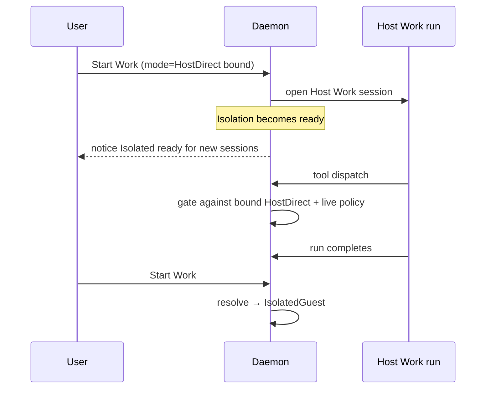
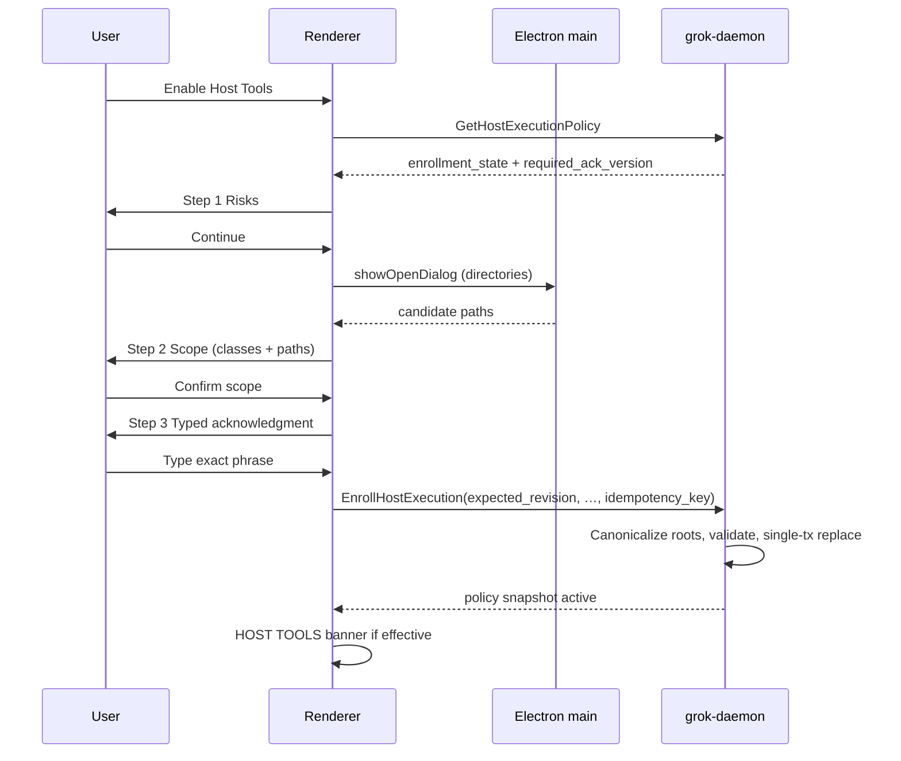
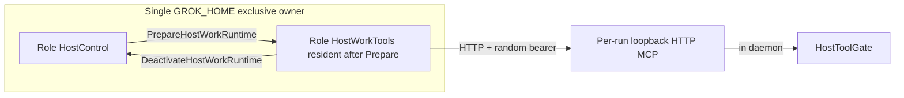

# Dual-mode Work execution: Host Tools (opt-in) + Isolated Guest Work

| Field | Value |
|-------|-------|
| **Author** | Grok Desktop engineering (draft owner: systems architect) |
| **Date** | 2026-07-13 |
| **Status** | Host Tools v1 implemented and locally qualified; isolated backend and native Windows release qualification remain open |
| **Supersedes / amends** | ADR 0003 (partial), ADR 0004 (Work readiness wording), AGENTS.md isolation wording, `docs/architecture/principles.md`, `docs/quality/linux-ga.md` Limited Mode + host-ACP rules, `docs/platform/threat-model.md`, `docs/research/official-grok-surfaces.md` capability routing, capability resolution in `CapabilityResolver` |
| **ADR** | [`docs/decisions/0032-explicit-dual-mode-work-execution.md`](../decisions/0032-explicit-dual-mode-work-execution.md) |
| **IPC impact** | Epoch **25** introduced enrollment and backend projection; epochs **27–28** added durable execution, cancellation, and bounded run snapshots. Current: **28**. |
| **Schema impact** | SQLCipher schema **25** binds run/backend and policy; schema **26** adds the durable Host enrollment command journal |

---

## Overview

Before this plan, Grok Desktop failed closed into **Limited Mode** whenever a qualified isolation backend (Windows HCS utility VM or Linux QEMU/KVM broker + signed guest) was absent. That invariant remains correct for strong isolation, but it left users without local filesystem, shell, or MCP-class productivity until guest images and brokers ship—an external gate documented in `docs/plan/06-open-risks-and-external-gates.md` and `docs/quality/linux-ga.md`.

This design introduces a **long-term dual-mode product model**:

1. **Isolated Work** — the existing secure target: tools run only inside a signed utility guest behind the privileged broker (`IsolationRuntime`, `PrivilegedGateway`, guest ACP via `GrokAcpExecutionBoundary::IsolatedGuest`).
2. **Host Tools** — an **explicit, risk-aware, revocable** opt-in that allows a bounded set of Work tools to execute on the real host under daemon-owned policy, approvals, and path allowlists, driven by a **daemon-mediated Host Tools MCP** consumed by a **permission-brokered host Work ACP session** (see § Host Tools agent/runtime model).

Host Tools is **not** a silent compatibility fallback. Guest failure, missing images, or unqualified probes **never** auto-enable host execution. Limited Mode remains the default when neither Isolated Work is ready **nor** Host Tools is durably enrolled **and** the Host Work runtime can be composed.

**Isolated Work remains the only path that satisfies the strong-isolation full-product GA bar** (linux-ga / Windows HCS qualification). Host Tools is a **risk-accepted product mode** that does not substitute for isolation qualification.

## Implementation outcome (2026-07-13)

Host Tools v1 is implemented end to end. This section is the handoff ledger;
the design sections below preserve the decisions and contracts that led to it.

| Phase | Outcome | Evidence |
|---|---|---|
| ADR and invariants | Complete | ADR 0032, AGENTS, architecture principles, threat model |
| ACP feasibility boundary | Complete | constrained HostWorkTools role, exclusive ACP-home ownership, fail-closed runtime preparation |
| Durable policy | Complete | SQLCipher schemas 25–26; versioned enrollment, roots, tool classes, revision and replay journal |
| Capability and IPC | Complete | protocol epochs 25–28; daemon-owned `work_execution_backend`, readiness, authoritative active-run state, run list and approval projection |
| Host bridge | Complete | authenticated per-run loopback Streamable HTTP MCP, closed tool set, bounded framing, bearer/run binding, and strict-sandbox CA provisioning |
| Filesystem tools | Complete | capability-rooted list/read plus reparse-aware write validation |
| Mutating tools | Complete | exact write/process approval, intent-before-effect journal, bounded argv/environment/output, interruption review |
| Desktop UX | Complete | three-step enrollment, native root chooser, exact warning phrase, persistent Host indicator, revoke confirmation, Work composer, Activity approvals/cancel/reload |
| Local qualification | Complete | desktop lint/typecheck/test/build, Rust fmt/clippy/workspace tests, Go suites, Nix flake checks, Wisp headless enrollment/revoke flow, production Electron CDP route/security/responsive probe |

Delivered commits, in implementation order:

```text
4c5ff20 docs(security): define explicit host work authority
d66bd1a test(acp): prove constrained host tools session contract
f36ec70 feat(sqlcipher): persist host policy and work backend
4009b2a feat(protocol): add host work enrollment contracts
6b571f6 feat(daemon): persist explicit host tools enrollment
e4d0f39 feat(sqlcipher): journal host enrollment mutations
74578ad feat(acp): add exclusive host work runtime roles
47b97c0 feat(work): add policy-free host tools MCP helper
2390a74 feat(work): add capability-rooted host filesystem reads
36610ff feat(work): authenticate per-run host tool bridge
66f641c feat(work): dispatch durable host work turns
5a232ef feat(work): journal approved host mutations
202663c feat(work): secure and package host tools bridge
18b3c0a feat(desktop): expose explicit host tools work mode
94d2f17 fix(security): enforce frame policy in protocol headers
e082917 fix(nix): refresh guest runner module hash
a4ca0ab docs(work): reconcile host tools implementation
d268147 fix(work): close host authority state gaps
```

Still open by design or external qualification:

- Isolated Guest execution, signed guest publication, and real HCS/QEMU release
  matrices remain on the parallel isolation track.
- Exact signed Windows x64/ARM64 installers still require the documented native
  Windows workers; Linux cross-compilation is not release evidence.
- Third-party Host MCP installers and host computer-use remain out of scope.
- Native production Electron now runs successfully in Wisp's hidden compositor
  with an explicit private `XDG_RUNTIME_DIR`; Chrome DevTools MCP attached to
  its loopback CDP target without taking focus from the user's desktop.

### Multi-turn Work conversation completion (2026-07-13)

Host Work now behaves as a conversation rather than a one-shot Activity item:

- Starting Work navigates directly to the durable conversation. Activity
  remains the cross-run monitor, not the primary interaction surface.
- A Work thread may contain multiple sequential HostDirect runs. At most one
  run may be active, and an `interrupted_needs_review` run must be resolved
  before another turn starts.
- Every follow-up is dispatched through `StartHostWork`; the daemon rejects an
  unprivileged Chat turn for any thread already owned by Host Work.
- The daemon constructs each fresh official ACP session with bounded prior
  active user/assistant messages, the canonical enrolled root, available tool
  names, exact-approval behavior, and the new user request. Tool authority is
  never stored in or inherited from transcript text.
- Conversation projections include every bounded Host Work run for the thread.
  The renderer keeps planning/running state, exact approval action/target/data,
  allow/deny, cancellation, and terminal results inline with the transcript.
- Work-only threads do not expose Chat model, search, retry, regenerate, edit,
  or branch controls.

Local acceptance used the persistent `qa-local` Electron profile on the
loopback CDP endpoint in an off-screen wlroots compositor. The first turn
requested `host_process_exec` for `pwd`, paused on the inline exact approval,
and returned `/home/friend/dev/test-work` after one-time approval. A second
turn in the same thread recalled that exact path, invoked
`host_filesystem_list`, and completed on the conversation route. The production
CDP security/accessibility/responsive probe also passed. This acceptance run
also exposed a stale pre-approval run revision at terminal completion: the
assistant result was durable but the run became failed. Completion now reloads
the authoritative post-approval revision; a repeated approved `pwd` turn
finished as `completed` at revision 5, with a regression test that simulates
the approval revision changes. Wisp MCP could not
create its own nested compositor in this particular agent process because its
server lacked `XDG_RUNTIME_DIR`; no visible workspace or user focus was used.

---

## Design baseline (pre-implementation)

### State before this plan

Capability truth is daemon-owned ([ADR 0004](../../docs/decisions/0004-daemon-owned-credentials-and-capabilities.md)). `CapabilityResolver` in `crates/grok-application/src/capabilities.rs` gates Work / Shell / MCP exclusively on:

```text
work_ready = subscription_authenticated && strong_isolation_ready
```

When `ready` is true, `status()` **always** sets `reason_code = "ready"` and `reason = "Available."` — Available backends must not overload `reason_code`.

`IsolationRuntime` (`crates/grok-application/src/isolation_runtime.rs`) sets `strong_isolation_ready` only when the broker probe succeeds **and** a journaled `runner.health` guest-control call succeeds under PoP. Failures clear readiness; comments explicitly forbid host-exec fallback.

Official surface and ACP reality at the design baseline:

| Fact | Location |
|------|----------|
| Host ACP is **auth/control only**; adapter rejects host `open_session` / prompt | `docs/research/official-grok-surfaces.md` § Mandatory controls; `GrokAcpRuntime::require_guest_execution`; `GrokAcpExecutionBoundary::{HostControl, IsolatedGuest}` |
| Files/shell/local MCP routed **Guest ACP only** today | official-surfaces capability table |
| `HostPermissionChannel` delivers ACP permission requests to the daemon for Allow/Reject | `crates/grok-acp/src/permission.rs` |
| `AgentRuntime` is session/prompt/cancel oriented; tools appear as `AgentToolCall` events | `crates/grok-application/src/agent_runtime.rs` |
| `ApprovalService` / `SideEffectService` exist; no host tool dispatch pipeline yet | `approvals.rs`, `effects.rs` |
| Runtime gating is **facts-based** in `CapabilityResolver`; domain `CapabilityRequirement.requires_strong_isolation` is static metadata, not the live gate | `capability.rs`, `capabilities.rs` |
| MCP unavailable reason today | `mcp_sandbox_unavailable` |

Product surfaces at the design baseline reflected Limited Mode:

| Layer | Behavior today |
|-------|----------------|
| Application | `CapabilityFacts.strong_isolation_ready`; no host-execution fact |
| Daemon | `handler.rs` `capability_facts()` refreshes isolation; ignores caller-supplied readiness |
| Desktop | `limitedMode: !workAvailable` in `electronDesktopClient.ts`; AppShell “Limited mode” |
| Docs | ADR 0003, AGENTS.md, linux-ga: no host-exec fallback |

### Pain points

1. **Competitiveness gap**: peers offer host filesystem and shell immediately.
2. **Binary degradation**: only “full isolation” or “no tools.”
3. **Silent-fallback temptation**: must be forbidden structurally.
4. **Execution architecture gap**: enabling `Capability::Work` without defining who runs tools either violates host-ACP auth-only or ships a dead capability.

---

## Goals & Non-Goals

### Goals

1. Three stable product states: **Limited Mode**, **Host Tools**, **Isolated Work**.
2. **Conscious risk enrollment** before any host tool execution.
3. A concrete **Host Tools agent/runtime model** that maps Grok Build Work sessions → policy → approvals → host ops without silent guest fallback.
4. Parallel backends behind one product UI, with **dedicated `work_execution_backend` projection** (not overloaded `reason_code`).
5. Structural non-inheritance: Chat and scheduled automations cannot dispatch Host tools.
6. Daemon authority: policy, path validation, approvals, effect journaling, secrets.
7. Incremental PRs with **no-silent-fallback tests early** and **execution bridge before FS tools**.

### Non-Goals

1. Not replacing Isolated Work as the security-recommended / GA-isolation path.
2. Not host computer-use in v1.
3. Not arbitrary `npx` / unvetted MCP installers in v1.
4. Not auto-enabling Host on guest failure or first install.
5. Not elevating the Electron renderer to execute tools.
6. Not changing SuperGrok / BYOK / Grok Build **auth** boundaries (host ACP **authenticate** remains the subscription path).
7. Not treating bubblewrap/seccomp-on-host as Isolated Work.
8. Not BYOK-only Host Work branded as SubscriptionAcp (see Key Decision: subscription required).

---

## Proposed Design

### A. Product model (three states)

#### Canonical naming

| Product name (UI/docs) | Internal enum (**new** domain type) | Meaning |
|------------------------|-------------------------------------|---------|
| **Limited Mode** | no `WorkExecutionBackend` | Capability state. A Work run cannot start. |
| **Host Tools** | `WorkExecutionBackend::HostDirect` | User-enrolled. Tools run on host via Host Work runtime + daemon MCP. |
| **Isolated Work** | `WorkExecutionBackend::IsolatedGuest` | Isolation facts ready. Tools in utility guest. Recommended. |

`WorkExecutionBackend` is **introduced by this design** in `grok-domain`. It is
not a capability-state enum: `Limited` is deliberately absent because no
started Work run may be bound to a non-executing backend. Runs also gain a
`RunKind` classification so Chat and scheduled runs cannot carry a Work backend.

**UI badge / banner:**

- Host effective: `HOST TOOLS` (Clay `--warning` / `--warning-soft` per `DESIGN.md`)
- Isolated effective: `ISOLATED WORK`
- Limited: existing “Limited mode” connection plan when daemon online but Work unavailable — **not** used when Host is effective; **not** confused with daemon offline (“Connecting” / degraded remains connectivity-only)

#### Mode selection priority

```text
// Single definition — see also host_work_runtime_ready() below. No alternate branches.
fn resolve_backend(facts, policy) -> Option<WorkExecutionBackend> {
  if facts.strong_isolation_ready && facts.subscription_authenticated {
    return IsolatedGuest;  // preempts Host
  }
  if policy.is_effectively_active()
     && facts.subscription_authenticated
     && facts.host_work_runtime_ready
  {
    return HostDirect;
  }
  None
}
```

Rules:

1. **Isolated preempts Host** when isolation + subscription ready. Stored Host enrollment may remain; it is not the effective backend.
2. Isolation loss → Host **only if** Host still effectively enrolled **and** `host_work_runtime_ready`; never auto-enroll.
3. Renderer cannot select a backend.
4. **Subscription is required for Host Tools Work** (Key Decision; closed). BYOK never unlocks Host Work / Shell.
5. **Enrollment alone never yields HostDirect.** After enroll, mode stays Limited until `PrepareHostWorkRuntime` succeeds (see bootstrap).
6. **`StartWorkRun` requires** `resolve_backend().is_some()` and atomically
   persists `RunKind::Work` plus that immutable backend. Chat and scheduled runs
   reject any Work backend — runtime bootstrap is never a prompt side effect.

#### Capability availability mapping

| Capability | Isolated path | Host path (v1) | Limited |
|------------|---------------|----------------|---------|
| Work | `subscription && strong_isolation_ready` | `subscription && host_policy_effective && host_work_runtime_ready` | Unavailable |
| Shell | same as Work | `host_policy.tool_process_exec` (+ Work host path) | Unavailable |
| Mcp | `strong_isolation_ready` (reason `mcp_sandbox_unavailable` when not) | **Unavailable**: the packaged Host Tools transport is internal and does not grant arbitrary MCP capability | Unavailable |
| BrowserAutomation / ComputerUse | isolation + respective facts | **Unavailable** | Unavailable |

**Projection rules:**

- When Available: keep `reason_code = "ready"` and human `reason` describing **where** tools run (string only; not a branch key).
- Backend discrimination uses the dedicated `work_execution_backend` capability field plus `GetHostExecutionPolicy` — **never** Available-time reason codes like `work_backend_host`.
- New **Unavailable** reason codes only:
  - `host_tools_not_enrolled`
  - `host_tools_runtime_not_prepared` — enrolled + HostControl authenticated, but `PrepareHostWorkRuntime` not yet succeeded this daemon lifetime (or deactivated and not re-prepared)
  - `host_tools_runtime_unavailable` — official HostWorkTools runtime cannot compose or resume
  - `host_tools_auth_resume_failed` — prepare/role switch: non-interactive authenticate failed
  - `host_tools_runtime_busy` — role mutex / switch blocked (e.g. Setup auth while Host Work owns home)
  - existing: `work_execution_unavailable`, `subscription_session_unavailable`, `strong_isolation_unavailable`, `mcp_sandbox_unavailable`

**Advertising rule:** Work Available on Host **if and only if** `host_work_runtime_ready` (single definition below). Enrollment without prepare → Unavailable `host_tools_runtime_not_prepared` with CTA **Prepare Host Tools runtime**.

#### Mid-run mode evaluation and isolation flap (Issue 4)

| Evaluation point | Behavior |
|------------------|----------|
| Capability snapshot / UI refresh | Recompute effective mode from live isolation + policy |
| **New** Work run start | Bind `run.work_backend` durably to the resolved backend at start; refuse start if Limited |
| **Every host tool dispatch** | Re-check: policy still effective, authenticated per-run endpoint still bound, run’s bound mode still allowed. Deny with stable reason if not |
| Isolation becomes ready mid Host run | **Sticky run mode**: in-flight Host run keeps `HostDirect` until terminal (durable `runs.work_backend`); **new** runs become Isolated. **Chrome:** while any non-terminal run is Host-bound, keep **HOST TOOLS** warning chrome even if global effective mode is Isolated (see § Persistent indicator). Notice: “Isolated Work is ready — new sessions use the protected guest. This session still runs on this computer.” |
| Isolation lost mid Isolated run | Existing isolation/interrupt paths; do **not** migrate the run to Host mid-flight. New runs may use Host if enrolled |
| Policy revoked mid Host run | Cancel in-flight tool dispatches; non-idempotent effects → `interrupted_needs_review`; run fails closed |
| Daemon restart mid Host run | Recover bound mode from `runs.work_backend`; Host-bound interrupted runs stay Host for review — **never** auto-migrate to Isolated |
| Isolation probe thrash | Mode may flip on snapshots; **sticky per-run** prevents tool mid-call backend swap. Metrics: `work_mode_transition_total{from,to}` |



### B. Risk-awareness UX (critical)

#### Entry points

1. **Primary**: Settings → **Work execution** section (daemon-backed; pattern from `SettingsView.tsx`).
2. **Secondary**: When user navigates to Work / Composer Work affordance while Work is Unavailable:
   - Show **blocking setup panel** (full panel in Work route, not toast):  
     - If not subscribed: CTA **Connect Grok Build**  
     - If not enrolled: CTA **Review Host Tools risks** + secondary **About Isolated Work**  
     - If enrolled + subscribed but `host_tools_runtime_not_prepared`: CTA **Prepare Host Tools runtime** (calls `PrepareHostWorkRuntime`)  
     - If `host_tools_auth_resume_failed`: CTA **Reconnect Grok Build** then re-prepare  
   - Composer stays gated on `work.available` for **sending** prompts; the setup panel is how availability is earned (enroll → prepare → Available).
3. **Not** entry points: deep links, first-run default-on, tray toggle without modal, env vars, renderer storage; **not** `StartWorkRun` as bootstrap (no chicken-egg).

#### Enrollment flow (multi-step)

Electron submits non-secret intent; daemon owns durable grant (spirit of ADR 0005).



**Step 1 risks** (structure fixed; legal/product owns final copy):

1. Full user privilege on this computer for allowed tools.
2. Prompt injection from files, pages, tool metadata, or model instructions.
3. No utility-guest boundary (unlike Isolated Work).
4. Exfiltration risk via model/provider traffic under existing network policy.
5. **Approved programs you run with Host Tools can use the network as your user** (no network namespace isolation for child processes in v1 — accepted residual).
6. Supply chain risk if additional MCP is later enabled.
7. You can revoke Host Tools anytime; new host tool dispatch stops immediately.

Footer: Isolated Work is recommended when available; Host Tools is optional productivity.

**Step 2 scope:**

- Path roots via **main-process folder chooser**; daemon re-canonicalizes and may reject (see enroll errors).
- Tool classes: v1 `fs_read`, `fs_write`, `process_exec`. The internal MCP transport is not an enrollable fourth class.
- Consent is durable until explicit revoke. There is no wall-clock or daemon-session expiry in v1; an acknowledgment-version change makes the grant ineffective until re-enrollment.
- **Broad-scope confirm** (mandatory UX **and** daemon gate): if any root is filesystem root (`/` or drive root `X:\`) or the user’s home directory, UI requires checkbox “I am granting access to my entire home/drive” **and** enroll request must set `broad_scope_acknowledged = true` (included in the request fingerprint). Daemon rejects broad roots when the flag is false. UI-only checking is never sufficient.

**Step 3 typed acknowledgment:**

- Exact phrase for `HOST_ACKNOWLEDGMENT_VERSION` (English v1 constant in domain; see Open Questions for localization).
- Primary button disabled until match; no “Don’t show again.”

#### UX state matrix (Issue 9)

| enrollment_state | effective mode | subscription | isolation | UI |
|------------------|----------------|--------------|-----------|-----|
| `disabled` | Limited | any | no | Settings: Enable CTA; Work setup panel; no Host banner |
| `disabled` | Limited | no | no | Setup: connect subscription first |
| `active`, runtime prepared | HostDirect | yes | no | Banner HOST TOOLS; badge HOST; Composer Work enabled; Settings: **Host runtime ready** + Deactivate |
| `active`, not prepared | Limited | yes | no | No Host warning banner; Settings/Work: **Prepare Host Tools runtime**; reason `host_tools_runtime_not_prepared` |
| `active` | IsolatedGuest | yes | yes | Badge ISOLATED; Settings: Host enrollment “saved, not active (Isolated preferred)”. If Host-bound run still live → HOST TOOLS warning (chrome derivation) |
| `active` + sticky Host run | IsolatedGuest (global) | yes | yes | Banner: **HOST TOOLS — active session on this computer**; dual plan string |
| stale acknowledgment / `needs_reconsent` | Limited | yes | no | Settings: Re-enable; Work Unavailable |
| `active` + official runtime unavailable | Limited | yes | no | reason `host_tools_runtime_not_prepared` |
| any | Limited | yes | no | Plan “Limited mode” only when Host not effective **and** no Host-bound active run |
| daemon offline | n/a | n/a | n/a | Plan “Connecting” / degraded — **never** show HOST badge |

**Enroll error mapping (daemon → UI):**

| Daemon error | UI |
|--------------|-----|
| phrase mismatch / wrong ack version | Inline field error; stay on step 3 |
| `expected_revision` conflict | Refresh policy; toast “Settings changed; try again” |
| root missing / not directory | Highlight path; “Choose another folder” |
| root is symlink that escapes or is denied private dir | “This folder can’t be used” |
| empty tool classes | Disable Continue on step 2 |
| broad root without acknowledgment | Highlight roots; force broad-scope checkbox + re-submit |
| official runtime unavailable | Keep Work unavailable; direct the user to Setup/runtime repair |

**Folder picker:** Electron main `dialog.showOpenDialog({ properties: ['openDirectory'] })` only supplies **candidates**. Daemon `EnrollHostExecution` is authoritative: exists, is directory, canonicalize, reject reparse-escape, reject daemon private paths (DB, vault, guest images, integration staging).

**Typed phrase / IME:** v1 ships one exact English phrase. The daemon trims surrounding whitespace and otherwise compares the phrase exactly. Localization of the **required typed string** requires a new acknowledgment version; UI chrome may be localized independently.

**Banner a11y:** `role="status"` + `aria-live="polite"` for appearance; Disable control is a real `<button>`; warning colors meet DESIGN.md contrast notes for Clay on soft surfaces.

#### Persistent indicator (chrome derivation)

Shell chrome must **not** show pure Isolated branding while host privilege remains live on any run.

```text
display_host_warning =
  effective_mode == HostDirect
  OR exists non-terminal run with bound work_backend == HostDirect

display_mode_label =
  if display_host_warning && effective_mode == IsolatedGuest:
      "Isolated Work — Host session active"
  elif effective_mode == HostDirect: "Host Tools"
  elif effective_mode == IsolatedGuest: "Isolated Work"
  else: "Limited mode"  // only when daemon online and Work unavailable
```

| Condition | Banner | Work badge | Plan string |
|-----------|--------|------------|-------------|
| effective HostDirect | **HOST TOOLS** — tools run on this computer (Settings · Disable) | `HOST` | Host Tools |
| effective Isolated, **no** Host-bound run | none (optional subtle Isolated status) | `ISOLATED` | Isolated Work |
| effective Isolated, **Host-bound run active** | **HOST TOOLS** — active session on this computer; new sessions use Isolated Work | `HOST` (or dual chip) | Isolated Work (Host session active) |
| daemon offline | none | none | Connecting / degraded |

**Ongoing risk UX (not only enrollment):**

- Banner whenever `display_host_warning` (not only global effective Host).
- Work **transcript / session header** always shows **bound** mode of the open run (`Host` vs `Isolated`).
- **Every** host tool approval dialog (including Low `fs_read`) restates “Runs on this computer (Host Tools)” when bound mode is Host.
- Settings shows current roots/classes and last acknowledged version.
- Tool cards label `Host` vs `Isolated` from bound mode.

#### Disable / revoke / re-consent

| Event | Re-consent? |
|-------|-------------|
| Same ack version upgrade | No |
| `HOST_ACKNOWLEDGMENT_VERSION` bump | Yes |
| DB wipe | Yes |
| Scope change (any root/class change) | **Full re-enroll** (replace mutation; no delta API) |
| N-day TTL alone | No (default) |
| Isolation loss → Host | No if still enrolled |

Revoke: Settings or banner → single confirm → `RevokeHostExecution(expected_revision)`.

---

### C. Host Tools agent/runtime model (critical — Issue 1)

#### Decision (chosen)

**Permission-brokered host Work ACP sessions + daemon-mediated Host Tools MCP as the only productive tool surface.**

Rationale:

- Today `GrokAcpExecutionBoundary::HostControl` rejects sessions; IsolatedGuest is the only session boundary (`grok-acp/src/runtime.rs`).
- Official research forbids exposing host prompt/tool methods **without** a product amendment; Host Tools **is** that amendment, narrowly scoped.
- Approving agent-native ambient shell without daemon I/O would forfeit moment-of-use path validation.
- A daemon-owned MCP tool server lets every FS/exec op pass `HostExecutionPolicy` → `ApprovalService` → `SideEffect` → `HostDirectBackend` with reparse-at-use.

**Rejected for v1:**

| Option | Why not |
|--------|---------|
| Enable host ACP tools with permission-only broker (agent performs I/O) | Weak path/TOCTOU control; cannot enforce roots at open(2) |
| Non-ACP “local tools” product without Grok Build | Must not set `Capability::Work` / `SubscriptionAcp` |
| Silent guest→host | Forbidden |

#### New ACP execution boundary

```rust
// crates/grok-acp — conceptual amendment
enum GrokAcpExecutionBoundary {
    HostControl,      // auth only (unchanged default)
    HostWorkTools,    // NEW: session/prompt allowed IFF Host Tools effective
    IsolatedGuest,    // existing
}
```

Factory: `GrokAcpConfig::host_work_tools(component, policy_roots, grok_home)` — **only** callable from daemon composition when starting a Host Work run. Unit tests: HostControl still rejects sessions and non-empty workspace roots; HostWorkTools allows session only with non-empty validated roots.

#### Dual ACP runtime composition

Today boundary is fixed at `GrokAcpRuntime::start()`; HostControl **rejects non-empty workspace roots** (`runtime.rs`). Host Work therefore needs a **HostWorkTools** process that can open sessions — **not** a reconfigure-in-place of the HostControl boundary enum alone.

**Code constraint (authoritative):** `GrokHomeSpec::provision` takes an **exclusive** `.runtime.lock` (`GrokHomeError::RuntimeBusy` if another owner holds it — `isolation.rs`). Two simultaneous ACP runtimes **cannot** share one `GROK_HOME` under the current lock model. `GrokBuildAuthService` only stores a **process-local boolean** after `AgentRuntime::authenticate` on whatever runtime it was bound to; it does **not** export transferable credentials over IPC (correct — secrets stay in the component/home).

#### Credential continuity decision (Key Decision)

**Chosen: Option A′ — shared authenticated `GROK_HOME` with exclusive serial ownership + non-interactive resume (Option B fail-closed).**

Not Option C (second interactive OAuth for Host Work) unless resume fails and the user returns to Setup.

| Piece | Rule |
|-------|------|
| Home path | **One** install home: existing HostControl `GrokHomeSpec` / `home_path()` (same `installation_id`). No second “host-work-tools” home for auth. |
| Lock | At most **one** `ProvisionedGrokHome` owner (existing exclusive lock). Role = `HostControl` **or** `HostWorkTools`, never both. |
| Auth materials | Owned by the official Grok Build component **under that single home** after a successful HostControl `authenticate`. Daemon never copies `auth.json` / tokens (product invariant). |
| HostControl role | Default when Host Work runtime is **not** prepared/active: authenticate-only, empty workspace roots (today). |
| Switch → HostWorkTools | **Only via `PrepareHostWorkRuntime`** (or internal re-prepare), **never** as a side effect of `StartWorkRun`. Steps under **role mutex**: (1) require policy effective + HostControl authenticated; (2) shutdown HostControl + drop lock; (3) provision same home as HostWorkTools; (4) start agent; (5) non-interactive `authenticate` resume. |
| Resume success | Retain the authenticated method daemon-side for this process; keep HostWorkTools **resident** (warm pool — see idle policy); then `host_work_runtime_ready` becomes true. No authentication material or separate auth-ready bit is projected to the renderer. |
| Resume failure | **Fail closed:** tear down HostWorkTools, attempt to restore HostControl, leave runtime readiness false, and require Setup re-auth then Prepare again. Never open Host Work unauthenticated. |
| Switch ← HostControl | Via **`DeactivateHostWorkRuntime`**, Host policy revoke/re-enroll, runtime loss, or daemon exit. Shutdown HostWorkTools and re-provision HostControl; a later Work run requires Prepare again. |
| What “session state” means | ACP session ids, prompts, and per-run MCP endpoints die with the run/process. Auth materials the **component** keeps under the shared home may remain for a future Prepare resume — daemon never exports them. |
| Concurrent roles | **Forbidden**. All provision/start/shutdown under a **daemon `AcpHomeRole` mutex** so `capability_facts` / Prepare / Deactivate / Setup auth cannot double-provision (`RuntimeBusy`). |
| Auth fact rebind | `subscription_authenticated` is read from the **current role owner**’s last successful authenticate (HostControl or HostWorkTools). While HostWorkTools is resident and authed, Setup interactive auth is busy (`host_tools_runtime_busy`) until Deactivate. |
| Rejected | Chicken-egg “start run to become ready”; HostControl-only boolean as `host_work_runtime_ready`; parallel homes; secret copy; second OAuth happy path. |

#### Host Work runtime bootstrap (`PrepareHostWorkRuntime`)

**Problem:** `resolve_mode` / Work Available / `StartWorkRun` all require `host_work_runtime_ready`, but resume must run on a HostWorkTools process. Resume therefore **cannot** be first triggered by `StartWorkRun`.

**Chosen bootstrap (recommended path A):**

| RPC | Purpose |
|-----|---------|
| `PrepareHostWorkRuntime` | Performs the serialized role switch + non-interactive resume. On success: HostWorkTools resident and capabilities refresh → HostDirect + Work Available. |
| `DeactivateHostWorkRuntime` | Inverse: stop HostWorkTools, restore HostControl, capabilities → Limited (if isolation is still down) with `host_tools_runtime_not_prepared`. |
| Runtime status | `GetHostExecutionPolicy.runtime_prepared` and `ResolveCapabilitiesResponse.host_work_runtime_ready` are the public projections. |

**When UI calls Prepare:**

1. After successful **EnrollHostExecution** (Settings may auto-offer “Prepare now”).
2. Explicit Settings / Work panel button **Prepare Host Tools runtime**.
3. **Not** on every capability poll; **not** inside `StartWorkRun`.

**Preconditions for Prepare:** policy effective; roots non-empty; HostControl currently authenticated (or restore HostControl first if orphaned); no non-terminal Host-bound run requiring an opposite transition mid-flight. MCP endpoint creation is per-run and is not a Prepare-time package dependency.

**Post-success warm policy:** HostWorkTools **stays up** after Prepare (resident warm runtime) so `host_work_runtime_ready` remains true and the user can start Work without another switch. V1 has no silent idle deactivation; only explicit Deactivate, revoke/re-enroll, runtime loss, or daemon exit removes readiness.

**Return to HostControl-only auth management:** user (or Settings) calls **DeactivateHostWorkRuntime**, or revoke Host policy. Then Setup Grok Build authenticate works on HostControl again.

```mermaid
sequenceDiagram
    participant U as User
    participant UI as Settings / Work panel
    participant D as Daemon role mutex
    participant HC as HostControl
    participant HWT as HostWorkTools

    U->>UI: Enroll Host Tools
    UI->>D: EnrollHostExecution
    D-->>UI: enrolled; Work still Unavailable (not_prepared)
    U->>UI: Prepare Host Tools runtime
    UI->>D: PrepareHostWorkRuntime(idempotency_key)
    D->>D: lock AcpHomeRole
    D->>HC: shutdown + drop home lock
    D->>HWT: provision same GROK_HOME + start
    D->>HWT: authenticate resume (non-interactive)
    alt ok
        D->>D: retain authenticated method; runtime ready
        D-->>UI: prepared; Work Available HostDirect
        U->>UI: Start Work turn
        UI->>D: StartWorkRun (mode already HostDirect)
    else fail
        D->>HC: restore HostControl
        D-->>UI: host_tools_auth_resume_failed
    end
```



| Runtime role | Lifecycle | GROK_HOME | Responsibilities |
|--------------|-----------|-----------|------------------|
| **HostControl** | Default; after Deactivate | Shared install home | Interactive authenticate only; no sessions |
| **HostWorkTools** | After successful Prepare until Deactivate | **Same** home (serial) | Resident agent; resume already done; `open_session` / prompt / cancel; Host Tools MCP |
| **IsolatedGuest** | Guest track | Guest-managed | Unchanged |

#### Unified `host_work_runtime_ready` (single definition)

```text
// Canonical — used by resolve_mode, CapabilityResolver Work/Shell, StartWorkRun gate.
// DELETE any HostControl-only alternate branch.

fn host_work_runtime_ready(facts) -> bool {
  facts.host_tools_runtime_composable
  && facts.host_policy_effective          // active, current ack version, non-empty scope
  && facts.host_roots_non_empty
  && facts.host_work_tools_role_up        // HostWorkTools currently owns shared home
  && facts.host_work_tools_subscription_ok // that process's authenticate succeeded
}

// Derived facts are daemon memory, never renderer-authored.
// host_work_tools_role_up: true iff current AcpHomeRole == HostWorkTools with live process.
```

**Implications:**

| State | `host_work_runtime_ready` | Work Host path | Mode |
|-------|---------------------------|----------------|------|
| Enrolled, HostControl auth only | **false** | Unavailable `host_tools_runtime_not_prepared` | Limited |
| Prepare in flight | false | Unavailable / busy | Limited |
| Prepare success, HostWorkTools resident | **true** | Available | HostDirect |
| Resume failed | false | Unavailable `host_tools_auth_resume_failed` | Limited |
| Deactivated | false | Unavailable `host_tools_runtime_not_prepared` | Limited |
| MCP endpoint cannot bind | true until a run starts | Start fails closed without executing a tool | HostDirect |

**External gate (residual, not a design branch):** whether Grok Build always resumes non-interactively from the same `GROK_HOME` after process recycle is an **ACP contract** risk. PR 4 contract-tests it; failure → `host_tools_auth_resume_failed` + Setup re-auth. Track on implementation-status / open risks as an external gate (like other ACP behaviors).

**Process cost:** one `grok agent stdio` at a time; after Prepare it stays resident until Deactivate.

#### MCP process model (authenticated loopback HTTP)

Host Work injects exactly one daemon-created `McpServer::Http` entry into the ACP `NewSessionRequest`. The endpoint binds an ephemeral IPv4 loopback port, uses the fixed `/mcp` path, and requires a fresh random bearer on every request. Neither the renderer nor model chooses the URL, credentials, server name, or tool catalog.

**Chosen transport: daemon-owned Streamable HTTP MCP**

| Element | Spec |
|---------|------|
| Listener | Daemon-owned `127.0.0.1:0`; exact `/mcp`; destroyed when the run terminals or is cancelled. |
| Authentication | 256-bit random bearer retained by the daemon and official child environment/session request only; Debug output redacts it. Host and Origin validation reject cross-origin/browser traffic. |
| Agent connection | HostWorkTools `open_session` injects one fixed-name HTTP server with the daemon URL and `Authorization` header. No discovered/file-configured MCP is enabled. |
| Strict sandbox compatibility | The official client constructs a TLS-capable HTTP client even for loopback HTTP. On Unix the daemon copies the public platform CA bundle into the private managed Grok home and sets `SSL_CERT_FILE` to that sandbox-readable immutable-content file. Strict sandbox remains enabled. |
| Policy/execution | All `HostToolGate` / `HostDirectBackend` work runs **inside the daemon** after the authenticated MCP handler validates the call. |
| Out of v1 | Arbitrary localhost servers, SSE compatibility endpoints, MCP-over-ACP, and user-configured MCP commands. |
| Managed config | Keep `mcps = false` / forbid `.mcp.json` / compat MCP discovery. **Only** the session-injected daemon MCP entry is allowed. |

```text
NewSessionRequest (Host Work):
  cwd = primary_root
  additional_directories = other_roots[]
  mcp_servers = [
    Http {
      url: "http://127.0.0.1:<ephemeral>/mcp",
      headers: { Authorization: "Bearer <per-run random>" }
    }
  ]
```

#### HTTP MCP binding (run binding, concurrency, approvals)

| Rule | Spec |
|------|------|
| Concurrent Host Work runs (v1) | **Max 1** non-terminal Host-bound Work run (matches single HostWorkTools role + simpler binding). Additional starts → conflict / queue. |
| Connection bind | At Host run start, daemon creates one listener and bearer pre-bound to `run_id` and policy revision. Calls never carry a client-selected run id. |
| Accept | IPv4 loopback peer, exact Host header, absent/allowed Origin, exact bearer, bounded header/body, and valid MCP JSON-RPC are all required. |
| Unbound calls | Reject if bearer/listener is wrong, run terminal, policy inactive/revised, or tool/schema is outside the closed set. |
| Multiplex | No shared global endpoint across runs in v1. |
| Approval wait | `tools/call` blocks in daemon until `ApprovalService` decides or approval `expires_at` (existing domain deadline). Helper/daemon RPC deadline ≥ approval expiry (cap e.g. 15 minutes). Agent-side MCP client timeout must be configured ≥ that cap where the runtime allows; otherwise fail with stable “approval wait exceeded”. |
| Cancel | Run cancel, Host revoke, or role switch away from HostWorkTools → daemon aborts in-flight HTTP RPCs; non-idempotent effects → `interrupted_needs_review`; endpoint closes. |
| Idle (run) | When run terminals, tear down the listener and bearer. **Does not** Deactivate HostWorkTools (runtime stays prepared). |

**Readiness:** use the **single** `host_work_runtime_ready` definition in § Host Work runtime bootstrap — no HostControl-only alternate.

If the strict sandbox cannot read the daemon-provisioned public CA bundle or
connect to IPv4 loopback, session MCP initialization fails before the run is
marked Running.

#### Multi-root → session cwd / additional_directories

| Policy | Session field |
|--------|----------------|
| `path_roots[0]` (ordinal 0) | `cwd` / `working_directory` — **primary** |
| `path_roots[1..]` | `additional_directories` (ACP) and HostWorkTools `workspace_roots` allowlist |
| Project-bound Work open | If project has a filesystem root, it must canonicalize under some enrolled root; that root becomes primary cwd for the run when possible |
| Tool paths | **Every** tool path re-checked against **full** enrolled root set (not only cwd) |
| Reject | `open_session` if requested cwd outside enrolled roots |

#### Control flow (implementable)

```mermaid
sequenceDiagram
    participant U as User
    participant UI as Renderer
    participant D as Daemon Work executor
    participant HC as HostControl ACP
    participant ACP as HostWorkTools ACP
    participant Ag as grok agent process
    participant Gate as HostToolGate
    participant Appr as ApprovalService
    participant FX as SideEffectService
    participant BE as HostDirectBackend

    Note over ACP: Prepare already succeeded; HostWorkTools resident
    U->>UI: Start Work turn
    UI->>D: StartWorkRun (idempotent)
    D->>D: resolve backend must be HostDirect; persist runs.work_backend=HostDirect
    D->>D: bind per-run loopback MCP + bearer to run_id
    D->>ACP: open_session(cwd, additional_directories, mcp_servers Http)
    ACP->>Ag: NewSessionRequest
    Ag->>D: MCP initialize over loopback + bearer
    D->>ACP: prompt(user text)
    Ag->>D: tools/call host_filesystem_read|…
    D->>Gate: dispatch bound op
    Gate->>Gate: policy class + path under roots
    alt write or exec
        Gate->>Appr: request Approval
        Appr-->>Gate: Granted / Denied
    end
    Gate->>FX: prepare SideEffect
    Gate->>BE: execute (reparse-at-use)
    BE-->>Gate: result
    Gate->>FX: succeed / fail / interrupt
    Gate-->>Ag: MCP result
    ACP-->>D: AgentEvent stream
    D-->>UI: run events / approvals
```

**Session open → authenticated MCP initialize → tool call → policy → approval → effect journal → backend → event stream** is the mandatory bridge acceptance path.

#### Host Tools MCP tool surface (v1)

Closed tool names only (the daemon MCP handler rejects all others):

| Tool | Class | Bounds |
|------|-------|--------|
| `host_filesystem_list` | `fs_read` | Max **500** entries per call; one directory level only; name, type, and size |
| `host_filesystem_read` | `fs_read` | Default max **1 MiB** for text; caller-selectable binary read hard max **8 MiB** (reject above hard max) |
| `host_filesystem_write` | `fs_write` | Max write **8 MiB** per call; approval + effect |
| `host_process_exec` | `process_exec` | argv array only; approval + effect; exec bounds in § Process execution |

#### Residual agent-native tools and sandbox

- HostWorkTools managed config: unmanaged MCP **off**; compat MCP **off**; session injects **only** the authenticated Host Tools HTTP MCP.
- **Only** Host Tools MCP tool names may reach OS I/O. Contract test: no `HostDirectBackend` write/exec without gate; no path op without MCP name in closed set.
- `HostPermissionChannel`: select **AllowOnce** only when the official request is an exact `UseTool` envelope for the `grok-desktop-host-tools__<closed-name>` namespace. Every other native tool permission is cancelled. The selected outer permission grants no OS authority; the daemon MCP gate still revalidates the exact call.
- `sandbox.profile=strict` retained; the managed CA copy solves native root loading without broadening filesystem or process authority.

#### Mapping to existing types

| Concern | Existing type / service |
|---------|-------------------------|
| Run lifecycle | `Run` / `ExecutionStore`; durable `work_backend` column |
| Approvals | `ApprovalService`, `RequestedAction`, `ApprovalRisk` |
| Effects | `SideEffectService`, `EffectKind::{FileWrite,ProcessExecution}` |
| ACP events | `AgentEvent`, `AgentToolCall` |
| Permissions | `HostPermissionChannel`, `AgentPermissionRequest` |
| Subscription fact | Rebind to current role owner; Prepare success sets HostWorkTools as fact source |
| Host Work sessions | HostWorkTools only after Prepare; `StartWorkRun` never role-switches |
| Runtime prepare | `PrepareHostWorkRuntime` / `DeactivateHostWorkRuntime` |

Chat pipelines (`StartConversationTurn`, xAI/SuperGrok rails) **must not** receive `Arc<dyn WorkToolBackend>`, HostWorkTools runtime, or MCP endpoint handles (see § Structural non-inheritance).

---

### D. Security architecture for Host mode

#### Authority model

```text
Renderer --IPC--> Work run use cases
                      |
                      v
            HostExecutionPolicy (SQLCipher)
                      |
        HostWorkExecutor (only Work surface)
                      |
     +----------------+----------------+
     |                                 |
 HostToolGate                    ApprovalService
     |                                 |
     v                                 v
 SideEffect journal ----------> HostDirectBackend --> OS
```

#### Policy object

```rust
// New domain types (grok-domain) — added by this design

pub enum RunKind { Chat, Work, Scheduled }
pub enum WorkExecutionBackend { HostDirect, IsolatedGuest }

pub struct HostExecutionPolicy {
    pub revision: u64,
    pub active: bool,
    pub acknowledgment_version: u32,
    pub acknowledged_at: UnixMillis,
    pub tool_classes: HostToolClasses,
    pub canonical_roots: Vec<String>, // canonical absolute
    pub broad_scope_acknowledged: bool,
    pub updated_at: UnixMillis,
}
```

Default: `active = false`.

#### Structural non-inheritance (Issue 10)

| Guard | Mechanism |
|-------|-----------|
| Chat cannot dispatch host tools | `ConversationService` / chat rails constructed **without** `HostWorkExecutor`; type-level: `HostWorkExecutor` only field on `WorkRunExecutor` |
| Scheduler cannot use Host | `ScheduledGuestDispatcher` remains guest-only and scheduled runs cannot carry a Work backend; test `scheduler_rejects_host_backend` |
| ACP host Work session not used by Chat | Chat never calls `open_session` on any ACP runtime; HostWorkTools runtime only owned by Work executor |
| Null backend default | Composition root wires `HostDirectBackend` only into Work executor graph |
| Tests | `chat_pipeline_cannot_dispatch_host_tools`, `scheduler_rejects_host_mode`, `host_control_boundary_rejects_session_without_host_tools_policy` |

#### No auto fallback

```text
ASSERT IsolationRuntime::refresh never activates Host policy
ASSERT only EnrollHostExecution sets active=true
ASSERT guest failure ∧ ¬enrolled ⇒ Limited
```

Tests land in **policy/capability PR**, not a late cleanup PR.

#### Path allowlists

1. Enroll stores canonical absolute roots (max **8**, path length bounded e.g. 4096).
2. Every op: lexical reject → open handle → final path still under root (reparse at use).
3. Symlink escape → deny.
4. Deny daemon private trees.

#### Approval model

| Class | Risk | Default scope |
|-------|------|---------------|
| fs_read / list | Low | Run or Resource after first grant |
| fs_write | Elevated/High | **Once for the exact canonical target** |
| process_exec | High | **Once** only in v1 |

#### Process execution policy (concrete — Issue 5)

**v1 decision: any executable with High approval**, not a fixed binary
allowlist. Process execution is explicitly full host-user authority. Filesystem
roots do not contain a child process, and interpreter/shell-shape filtering is
not represented as a security boundary.

| Rule | Spec |
|------|------|
| Tool shape | `host_process_exec` accepts **`argv: string[]` only** (min 1) and never inserts an implicit shell. Explicit shells, interpreters, scripts, and arbitrary binaries are allowed only after the same exact-command approval and full-authority warning |
| Executable resolution | `argv[0]` must be absolute path **or** resolve via `PATH` search under a **cleared** env; resolved path must `realpath`/`GetFinalPathNameByHandle` and not be a reparse escape to disallowed areas if product later restricts — v1 allows system binaries after approval |
| Cwd | Required; must be under an enrolled path root after canonicalization. This scopes the starting directory only, not process I/O |
| Env | Clear all; reconstruct allowlist only: `PATH` (platform default sanitized), `LANG`/`LC_*`, `HOME`/`USERPROFILE` (user), `TMP`/`TEMP` under system temp — **no** secret-bearing vars, no `XAI_API_KEY`, no Node injection vars (mirror ADR 0005 pinentry spirit) |
| Argv bounds | Max 64 args; each arg ≤ 8 KiB; total argv bytes ≤ 64 KiB |
| Timeouts | Default 60s wall; hard max 300s; kill process group on timeout/cancel |
| Output caps | stdout+stderr combined ≤ 1 MiB retained for tool result; truncate with marker |
| Network | **No** network namespace isolation in v1 — **accepted residual risk**: child processes have ambient host network. Document in threat model and enroll Step 1 (“programs you approve can use the network as your user”) |
| Concurrent execs | Max 2 in-flight per run |
| Windows | No implicit `cmd.exe`; create the approved application with exact argv and control the complete process tree |

#### Host v1 scope

| In Host v1 | Later / Isolated-only |
|------------|------------------------|
| Host Work ACP + Host Tools MCP | Host computer-use |
| fs list/read/write under roots | Managed browser on host |
| process exec with gates above | Arbitrary user MCP / `npx` |
| Enroll/revoke/banner | Host automations |
| Full read/write/exec v1 | Enterprise MDM remote disable |

V1 ships all three classes. Release policy may kill-switch the entire Host Tools
feature, but must not silently change a durable grant into a misleading partial
mode.

---

### E. Parallel backend design

```rust
#[async_trait]
pub trait WorkToolBackend: Send + Sync {
    fn backend(&self) -> WorkExecutionBackend;
    async fn list_dir(&self, req: PathReq) -> Result<DirListing, ApplicationError>;
    async fn read_file(&self, req: PathReq) -> Result<FileBytes, ApplicationError>;
    async fn write_file(&self, req: WriteReq) -> Result<(), ApplicationError>;
    async fn exec(&self, req: ExecReq) -> Result<ExecResult, ApplicationError>;
}
```

| Adapter | Role |
|---------|------|
| `HostDirectBackend` | Host FS/process with policy gates |
| `IsolatedGuestBackend` | Guest path (may stub until guest tools ship) |
| `NullWorkBackend` | Limited |

`IsolationProbe` / `IsolationRuntime` stay readiness-only.

#### Capability snapshot → Electron

Dedicated fields (Issue 3 — **required**, not optional):

```protobuf
enum WorkExecutionBackend {
  WORK_EXECUTION_BACKEND_UNSPECIFIED = 0; // Limited: no executable backend
  WORK_EXECUTION_BACKEND_HOST_DIRECT = 1;
  WORK_EXECUTION_BACKEND_ISOLATED_GUEST = 2;
}

message ResolveCapabilitiesResponse {
  repeated CapabilityStatus statuses = 1;
  WorkExecutionBackend work_execution_backend = 2;
  bool host_work_runtime_ready = 3;
  // True when any non-terminal Work run is durably HostDirect.
  bool host_bound_run_active = 4;
}

message HostExecutionPolicy {
  uint64 revision = 1;
  bool active = 2;
  uint32 acknowledgment_version = 3;
  uint32 required_acknowledgment_version = 4;
  uint64 acknowledged_at_unix_ms = 5;
  bool filesystem_read = 6;
  bool filesystem_write = 7;
  bool process_execute = 8;
  repeated string path_roots = 9;
  bool broad_scope_acknowledged = 10;
  uint64 updated_at_unix_ms = 11;
  bool runtime_prepared = 12;
  string unavailable_reason_code = 13;
}
```

Dedicated mutations: `GetHostExecutionPolicy`, `EnrollHostExecution`, `RevokeHostExecution`.

```ts
// Canonical IPC / client field: hostBoundRunActive (proto host_bound_run_active).
// Clients may also derive from the run list as defense in depth; daemon field is authoritative for chrome.
workExecution: {
  mode: "limited" | "host_direct" | "isolated_guest"
  hostWorkRuntimeReady: boolean
  hostBoundRunActive: boolean
}
limitedMode: workExecution.mode === "limited" && !workExecution.hostBoundRunActive
hostToolsEffective: boolean           // global effective == HostDirect
displayHostWarning: boolean          // hostToolsEffective || workExecution.hostBoundRunActive
```

Readiness checks: split or extend “Protected Work” into Isolated vs Host Tools CTAs.

#### Epoch

Epoch 25 introduced enrollment, policy, and backend projection. Epoch 27 added
durable Host Work start/cancel and epoch 28 added bounded run/approval
snapshots. The current `PROTOCOL_VERSION = 28` rejects 0–27; Rust/TypeScript
parity tests enforce the shared constant.

---

### F. Data model / persistence (Issue 6)

#### Schema 25 (STRICT, sqlcipher style)

```sql
CREATE TABLE host_execution_policy (
  singleton_id INTEGER PRIMARY KEY CHECK (singleton_id = 1),
  revision INTEGER NOT NULL CHECK (revision >= 0),
  active INTEGER NOT NULL CHECK (active IN (0, 1)),
  acknowledgment_version INTEGER NOT NULL CHECK (acknowledgment_version >= 0),
  acknowledged_at_unix_ms INTEGER NOT NULL CHECK (acknowledged_at_unix_ms >= 0),
  tool_filesystem_read INTEGER NOT NULL CHECK (tool_filesystem_read IN (0, 1)),
  tool_filesystem_write INTEGER NOT NULL CHECK (tool_filesystem_write IN (0, 1)),
  tool_process_execute INTEGER NOT NULL CHECK (tool_process_execute IN (0, 1)),
  broad_scope_acknowledged INTEGER NOT NULL CHECK (broad_scope_acknowledged IN (0, 1)),
  updated_at_unix_ms INTEGER NOT NULL CHECK (updated_at_unix_ms >= acknowledged_at_unix_ms)
) STRICT;

CREATE TABLE host_execution_roots (
  ordinal INTEGER PRIMARY KEY CHECK (ordinal BETWEEN 0 AND 7),
  canonical_path TEXT NOT NULL UNIQUE
    CHECK (length(canonical_path) BETWEEN 1 AND 4096 AND instr(canonical_path, char(0)) = 0)
) STRICT;

CREATE TABLE host_execution_commands (
  scope TEXT NOT NULL CHECK (length(scope) BETWEEN 1 AND 64),
  idempotency_key TEXT NOT NULL CHECK (length(idempotency_key) BETWEEN 1 AND 128),
  request_fingerprint BLOB NOT NULL CHECK (length(request_fingerprint) = 32),
  outcome_json TEXT NOT NULL CHECK (length(outcome_json) BETWEEN 2 AND 65536),
  PRIMARY KEY (scope, idempotency_key)
) STRICT;

-- Immutable run classification and optional concrete Work backend.
-- Existing rows migrate to the non-Work kind derived from their owning flow.
ALTER TABLE runs ADD COLUMN run_kind INTEGER NOT NULL DEFAULT 0
  CHECK (run_kind IN (0, 1, 2, 3));
ALTER TABLE runs ADD COLUMN work_backend INTEGER
  CHECK (
    (run_kind = 2 AND work_backend IN (1, 2)) OR
    (run_kind != 2 AND work_backend IS NULL)
  );
```

**Run classification ownership (schema 25):**

- Set `run_kind` and `work_backend` **immutably** when creating a run. A Work
  run requires a concrete backend; Chat and Scheduled require `NULL`.
- Legacy rows migrate to their owning flow's non-Work kind without inventing a
  backend. Ambiguous legacy rows remain `Unspecified` and cannot dispatch tools.
- Recovery keeps an interrupted Host-bound run on Host for review and never
  migrates it to Isolated automatically.
- Domain extends `Run` with `kind: RunKind` and
  `work_backend: Option<WorkExecutionBackend>` and validates the combination.

#### Enroll / revoke concurrency

- **`expected_revision` required** on enroll and revoke (same pattern as `UpdateDesktopPreferencesRequest`).
- **Single transaction:** update singleton → `DELETE FROM host_execution_roots` → insert new roots → insert command journal row with SHA-256 fingerprint of canonical request bytes (includes `broad_scope_acknowledged`).
- Enroll is **full replace** of roots and tool classes (no delta enrollment API). Scope expansion = full enroll with new revision + typed ack again.
- Idempotency: same key + same fingerprint → replay result; same key + different fingerprint → conflict.

#### Consent lifetime

- V1 enrollment is durable until explicit revoke.
- There is no wall-clock expiry or daemon-boot binding.
- A changed `HOST_ACKNOWLEDGMENT_VERSION` makes an older grant ineffective and requires a full replacement enrollment.

#### Migration

Insert singleton `active=0`, revision 0. Never backfill active host grants.

---

## API / Interface Changes

| Service | Methods |
|---------|---------|
| `HostExecutionPolicyService` | `get`, `enroll`, `revoke`, `effective_snapshot` |
| `HostWorkRuntimeService` | `prepare`, `deactivate`, `is_ready`; owns the serialized role switch |
| `HostWorkExecutor` | `start_run` (requires ready); permission/MCP loop; cancel |
| `HostToolGate` | `authorize_and_execute` |
| `WorkToolBackend` | list/read/write/exec |

### Runtime prepare / deactivate (epoch 25)

| RPC | Notes |
|-----|-------|
| `PrepareHostWorkRuntime` | No renderer-authored readiness facts; returns refreshed `HostExecutionPolicy` |
| `DeactivateHostWorkRuntime` | Restores HostControl and returns refreshed `HostExecutionPolicy` |
| Status reads | `GetHostExecutionPolicy` and `ResolveCapabilities` |

### EnrollHostExecution request (conceptual)

```text
expected_revision, acknowledgment_version, typed_acknowledgment,
tool_classes, path_roots[],
broad_scope_acknowledged,   // bool — required true if any root is home or drive/fs root
idempotency_key
```

Enroll does **not** call Prepare automatically in v1 (keeps enroll transactional and reviewable). UI should offer Prepare as the next step; optional product later: enroll response includes `suggest_prepare=true`.

Validation (daemon, authoritative):

- phrase + `acknowledgment_version == HOST_ACKNOWLEDGMENT_VERSION`
- ≥1 tool class; ≥1 root when any fs_* or `process_exec` (cwd) enabled
- each root: exists, directory, canonicalize, not private daemon paths
- **broad scope:** classify each root as `normal` | `home` | `filesystem_root`; if any is `home` or `filesystem_root`, require `broad_scope_acknowledged == true`. The fingerprint includes the bool so replaying a different acknowledgment conflicts.
- Drive/fs root (`/` or `X:\`) may be further restricted later by enterprise flag; v1 allows only with ack true.

### Capability reason strings

- Available: `reason_code=ready`; reason text mentions Host vs Isolated.
- Unavailable host path: `host_tools_not_enrolled`, etc. (see §A).

---

## Data Model Changes

| Item | Change |
|------|--------|
| SQLCipher | Schema **25**: host_execution_* tables **and** `runs.work_backend` |
| Domain | `WorkExecutionBackend`, `HostExecutionPolicy`, `HOST_ACKNOWLEDGMENT_VERSION`; `Run.work_backend` |
| Application | `CapabilityFacts` host fields; HostWorkExecutor; gate tests; create-run sets mode |
| Run record | Immutable sticky mode for flap + restart recovery |
| Chronicle | Records the epoch-25/schema-25 foundation, schema-26 journal, and epoch-27/28 execution projections |

---

## Alternatives Considered

### Alternative 1: Keep Limited only / invest only in guest packaging

**Pros:** Strongest security. **Cons:** Non-competitive. **Decision:** Retain as default + Isolated GA bar; not sole product path.

### Alternative 2: Silent host fallback

**Rejected.**

### Alternative 3: Host-only forever

**Rejected.**

### Alternative 4: OS sandbox as Isolated substitute

**Rejected.**

### Alternative 5: Renderer-local tools

**Rejected.**

### Alternative 6: Permission-brokered host ACP only (agent performs I/O)

**Pros:** Less new code. **Cons:** Weak reparse/path enforcement; residual agent sandbox bypass. **Decision:** Rejected as sole model; Host Tools MCP + `HostDirectBackend` required for productive I/O.

### Alternative 7: Non-ACP local agent branded as Work

**Pros:** Avoids amending host ACP boundary. **Cons:** Breaks SubscriptionAcp Work product story. **Decision:** Rejected for `Capability::Work`; could be a future separate surface.

### Alternative 8: Read-only Host Tools MVP first

**Pros:** Smaller residual risk; earlier ship. **Cons:** Incomplete parity. **Decision:** **Accepted as optional ship slice** — same bridge; UI may enroll only `fs_read` initially; write/exec follow.

### Alternative 9: Guest-style overlay without full VM

**Pros:** Some write isolation. **Cons:** Not a real VM boundary; complex; false sense of Isolated. **Decision:** Rejected for v1 branding as Isolated.

---

## Security & Privacy Considerations

### Docs / threat model (Issue 2)

ADR 0032 and PR 1 amend **all** of:

| Document | Amendment |
|----------|-----------|
| ADR 0003 | Host enrollment is not “fallback”; dual mode |
| ADR 0004 | Work readiness = Isolated facts **or** Host effective enrollment + runtime; still daemon-owned |
| AGENTS.md / principles.md | Dual-mode wording |
| linux-ga.md | Invariants #1–2: strong isolation still required for **Isolated** GA; Host Tools is separate risk-accepted mode and **does not** meet isolation GA; Host ACP remains auth-only **except** HostWorkTools when enrolled |
| threat-model.md | Host Tools section; residual ambient network; no silent fallback |
| official-grok-surfaces.md | Capability table row: Files/shell = Guest ACP **or** Host Tools MCP under enrollment; Host session allowed only for HostWorkTools boundary |
| implementation-status.md | Track Host Tools slices |
| protocol-and-persistence.md | Header fix + epoch 25 |

**Isolated remains the only path that satisfies the strong-isolation full GA bar.**

### Threat table (delta)

| Threat | Control |
|--------|---------|
| Enroll without understanding | Multi-step + typed ack + **daemon** broad-scope flag |
| Renderer forges broad roots | `broad_scope_acknowledged` in fingerprint; reject without |
| Prompt injection → host steal | Roots, approvals, MCP closed set, Chat non-inheritance |
| Agent ambient tools bypass MCP | Cancel all non-namespaced ACP permissions; OS I/O only via authenticated MCP → gate |
| Helper binary swap | Fixed package path + peer identity + re-verify |
| Guest down → host | No code path + tests in policy PR |
| Mode flap mid-tool | Sticky run mode; re-check policy each dispatch |
| Shell-string exec | Schema reject |
| Ambient child network | Documented residual; enroll copy |
| Scheduler/Chat misuse | Constructor isolation + tests |
| Symlink escape | Moment-of-use final path |

---

## Observability (Issue 15)

| Event / metric | Fields (non-secret) |
|----------------|---------------------|
| `host_execution_enrolled` / `revoked` | `revision`, active/current-ack state, `root_count`, `tool_classes` bitset — **no full paths in default logs** |
| `work_mode_transition` | `mode_from`, `mode_to`, `reason_code` |
| `host_tool_denied` | `reason_code` (`path_escape`, `class_disabled`, `policy_inactive`, `shell_shape_rejected`, …) |
| `host_tool_effect` | `effect_id`, `approval_id`, `kind`, `outcome` |
| Mode flap counter | `work_mode_transition_total` |
| Argv in diagnostics | **Redact**; never include in crash reports; tool UI may show argv to user under approval dialog only |

---

## Rollout Plan (Issue 14)

| Build | Host Tools availability |
|-------|-------------------------|
| Dev / dogfood | Daemon-owned loopback MCP is composed in-process; policy still defaults inactive |
| Packaged release | Same daemon-owned endpoint; no sibling helper is required; policy still defaults inactive |

The release kill switch is component composition plus durable enrollment, not
a broad runtime environment flag. The renderer cannot supply an endpoint,
bearer, tool catalog, or readiness fact.

**Kill-switch matrix:**

| official runtime | DB active | acknowledgment | effective |
|------------------|-----------|----------------|-----------|
| unavailable | 1 | current | **false** (runtime cannot prepare) |
| available | 1 | stale | false (`needs_reconsent`) |
| available | 1 | current | true if subscription + runtime prepared |
| available | 0 | — | false |

Tests cover unavailable runtime, inactive policy, stale acknowledgment,
unprepared runtime, invalid MCP authentication, and closed tool dispatch.

---

## Key Decisions

1. **Three states** — Limited / Host Tools / Isolated Work; domain `WorkExecutionBackend` has only executable backends, while absence means Limited.
2. **Host agent model** — HostWorkTools ACP + authenticated daemon-owned loopback HTTP MCP + `HostDirectBackend` (not arbitrary localhost MCP, not permission-only agent I/O).
3. **Credential continuity** — **shared install `GROK_HOME` with exclusive serial ownership**; non-interactive resume; fail closed + Setup re-auth. Preserves `.runtime.lock`.
4. **Bootstrap via `PrepareHostWorkRuntime`** — single `host_work_runtime_ready` definition; enroll alone ≠ Available; `StartWorkRun` never role-switches; warm resident HostWorkTools after Prepare; explicit `DeactivateHostWorkRuntime` returns HostControl.
5. **Subscription required for Host Work** — same as Isolated; BYOK never enables Host Work/Shell.
6. **Isolated preempts Host** when healthy; **sticky `runs.work_backend`** (schema 25) on flap + restart.
7. **Host warning chrome while any Host-bound run is active**, even if global mode is Isolated.
8. **No silent fallback** — only `EnrollHostExecution`; tests in early PRs.
9. **`work_execution_backend` IPC field** — Available `reason_code` stays `"ready"`.
10. **Daemon-owned durable policy** — schema 25, `expected_revision`, full-replace roots, current acknowledgment version, and server-enforced **`broad_scope_acknowledged`**; no clock or boot expiry.
11. **Process exec** — argv array only; High/Once; cleared env; bounds; ambient network residual accepted.
12. **Chat/scheduler structural isolation** — no Host backend in those graphs; explicit tests.
13. **ADR 0032 amends full doc set** (0003, 0004, AGENTS, linux-ga, threat-model, official-surfaces, implementation-status, chronicle).
14. **Do not advertise Work Available for Host until Prepare succeeds** (and PR 4 bridge exists).
15. **Signed component composition is the release kill switch**; environment
    helper overrides are debug-only and packaged policy defaults inactive.
16. **ACP non-interactive resume** is an external contract gate; fail closed if violated.

---

## Closed product decisions

1. Subscription authentication is required for Host Work.
2. Consent has no wall-clock expiry. Acknowledgment-version or scope changes
   require reconsent.
3. Isolated Guest is preferred for new runs when both backends are ready.
4. English acknowledgment v1 is exactly `I UNDERSTAND HOST TOOLS CAN CONTROL
   THIS COMPUTER`; the daemon trims surrounding whitespace and otherwise compares exactly.
5. V1 ships filesystem read/write and process execution.
6. Production enablement is signed release/daemon policy owned. Environment
   overrides are development-build only.

---

## ADR / Docs Impact

### ADR 0032 outline

**Title:** Dual-mode Work execution: Isolated Guest and opt-in Host Tools  

**File:** `docs/decisions/0032-explicit-dual-mode-work-execution.md`

**Decision:** Dual mode; HostWorkTools + Host Tools MCP; no silent fallback; subscription required; sticky runs; doc amendments listed above.

### PR 1 document list (expanded)

All rows in Security § Docs table + `docs/decisions/README.md` index + `docs/quality/implementation-status.md` + chronicle header repair.

---

## Risks

| Risk | Sev | Mitigation |
|------|-----|------------|
| Silent fallback regression | Crit | Early tests + ADR |
| Work Available without bridge | Crit | Advertising gate |
| Over-broad roots | High | UX + **daemon** `broad_scope_acknowledged` |
| Exec ambient network | High | Enroll copy + threat model |
| Mode thrash / misleading Isolated chrome | Med | Sticky run + Host warning while Host-bound runs exist |
| Strict sandbox blocks MCP helper | High | ACP feasibility gate before schema/UI; fail closed runtime_unavailable |
| Resume auth fails after role switch | High | Fail closed; restore HostControl; Setup re-auth; no second silent OAuth |
| Official ACP host session behavior differs | High | Contract tests; fail closed `host_tools_runtime_unavailable` |

---

## References

- `AGENTS.md`, `docs/architecture/principles.md`
- `docs/decisions/0003-managed-execution.md`, `0004-…`, `0005-…`, `0007-…`
- `docs/research/official-grok-surfaces.md` — host ACP auth-only; Guest tools table
- `docs/quality/linux-ga.md`, `docs/platform/threat-model.md`
- `crates/grok-acp/src/runtime.rs` — `GrokAcpExecutionBoundary`, `require_guest_execution`, HostControl rejects workspace roots, empty `mcp_servers` today
- ACP schema `McpServer::Stdio` — agent spawns absolute command
- `crates/grok-acp/src/permission.rs` — `HostPermissionChannel`
- `crates/grok-application/src/capabilities.rs` — `reason_code = "ready"` when available
- `crates/grok-application/src/agent_runtime.rs`, `approvals.rs`, `effects.rs`, `automation_scheduler.rs` (`ScheduledGuestDispatcher`)
- `crates/grok-daemon/src/handler.rs` — `capability_facts`
- Protocol/schema implementation: **epoch 28 / schema 26**
- `apps/desktop/src/views/SettingsView.tsx`, `electronDesktopClient.ts`, `DESIGN.md`

---

## PR Plan

### PR 1 — ADR 0032 + full documentation amendments

- **Title:** `docs(adr): dual-mode Work Host Tools + Isolated Guest (0032)`
- **Files:** ADR 0032; amend 0003, 0004, README; `AGENTS.md`;
  `principles.md`; `linux-ga.md`; `threat-model.md`;
  `official-grok-surfaces.md`; `implementation-status.md`;
  `06-open-risks…`; `protocol-and-persistence.md`
- **Dependencies:** none
- **Description:** Policy-only. Three states; HostWorkTools+MCP model; Isolated = only isolation GA path; no host exec code.

### PR 2 — ACP feasibility gate (must pass before schema or UI)

- **Title:** `test(acp): prove constrained Host Tools session contract`
- **Files:** ACP adapter contract tests and a non-shipping spike harness
- **Dependencies:** PR 1
- **Description:** Against the exact pinned official Grok Build component, prove
  stdio MCP injection, bounded additional directories, strict-sandbox helper
  launch, exclusive same-home HostControl/HostWorkTools switching,
  non-interactive auth resume, and rejection of residual native tools. This PR
  does not advertise Host Work. Any failed condition stops the track rather
  than weakening the boundary.

### PR 3a — Domain + SQLCipher policy store + run kind/backend binding

- **Title:** `feat(sqlcipher): host policy and immutable Work backend schema 25`
- **Files:** `grok-domain` policy + `RunKind` + `WorkExecutionBackend`;
  `grok-sqlcipher` schema 25 host-execution tables and run classification;
  migration/store tests; application policy ports
- **Dependencies:** PR 2 must pass
- **Description:** Default policy inactive. Legacy runs classify safely without
  inventing a Work backend. A started Work run requires HostDirect or
  IsolatedGuest; Chat and scheduled runs reject either backend.

### PR 3b — IPC epoch 25 + capability projection + invariant tests

- **Title:** `feat(daemon): host execution enrollment IPC and capability mode projection`
- **Files:** proto + `PROTOCOL_VERSION=25`; enroll includes `broad_scope_acknowledged`; policy service; `CapabilityResolver` + facts; daemon handler; desktop bridge; snapshot field **`host_bound_run_active`**; **tests:** default off, enroll/revoke, guest failure ≠ host, missing helper/runtime kill switch, ack mismatch, broad-scope reject without acknowledgment, Available still `reason_code=ready`, backend field set
- **Dependencies:** PR 3a
- **Description:** **Do not** set Work Available for Host until PR 4 bridge (use `host_tools_runtime_unavailable` if policy active but runtime not wired).

### PR 4 — Host Work execution bridge (HostWorkTools + Stdio helper + daemon IPC)

- **Title:** `feat(acp): PrepareHostWorkRuntime, HostWorkTools resident role, host-tools MCP gate`
- **Files:** `PrepareHostWorkRuntime` / `DeactivateHostWorkRuntime` IPC; `HostWorkRuntimeService` serialized role switch; HostWorkTools boundary; shared-home resume; unified `host_work_runtime_ready`; package `grok-host-tools-mcp`; per-run IPC; `HostWorkExecutor` (start only when ready); tests: enroll≠Available; prepare→Available; start without prepare fails; resume fail restores HostControl; no StartWorkRun role-switch; max 1 Host run
- **Dependencies:** PR 3b
- **Description:** Bootstrap path closes chicken-egg; then session open → helper → gate. **Prerequisite for productive FS.** Contract-test non-interactive resume (external gate).

### PR 5 — Risk-aware Settings UI + persistent warning chrome

- **Title:** `feat(desktop): add explicit Host Tools enrollment UX`
- **Files:** Settings enroll + Prepare/Deactivate controls; Work setup panel;
  persistent Host warning; broad-root and full-process-authority disclosures
- **Dependencies:** PR 4
- **Description:** UI becomes visible only after the real bridge and readiness
  path exist; no stub Prepare RPC and no dead advertised capability.

### PR 6 — Host filesystem read/list

- **Title:** `feat(work): HostDirectBackend filesystem read/list`
- **Files:** `HostDirectBackend` read/list; reparse-safe paths; wire MCP tools; tests escape denied
- **Dependencies:** PR 4
- **Description:** First productive Host tools. Optional product: enroll UI defaults to read-only classes.

### PR 7 — Host write + process exec + approvals

- **Title:** `feat(work): host write and process exec with approvals`
- **Files:** write/exec backend; exact-target/exact-command ApprovalService
  integration; SideEffect journal; spawn policy bounds; revoke mid-flight;
  interrupt → needs_review
- **Dependencies:** PR 6
- **Description:** Completes Host v1 tool classes. Invariant tests for dispatch gates live here.

### PR 8 — Explicitly defer third-party Host MCP

- **Title:** `feat(work): allowlisted extra host MCP` **or** `docs: defer host user-MCP`
- **Dependencies:** PR 7
- **Description:** Document the defer. V1 exposes only daemon-owned tools; no
  arbitrary MCP installers or `npx` execution path.

### PR 9 — Wisp headless + CDP end-to-end qualification

- **Title:** `test(e2e): Host Tools enroll banner revoke smoke`
- **Files:** desktop e2e/CDP
- **Dependencies:** PR 5 + PR 7
- **Description:** Wisp headless covers normal regression; Electron CDP inspects
  renderer/network/state; workspace 3 is reserved for real-desktop visual QA.

### Isolated Work track (parallel, not blocking Host)

- Continue existing isolation qualification outside this plan.
- When guest ready: implement `IsolatedGuestBackend` / guest ACP sessions;
  preemption contracts already exist from PR 3b.
- Do **not** wait on Host tool PRs; do **not** rewrite Host when guest ships.

### Merge order

```text
PR1 → PR2 (ACP gate) → PR3a → PR3b → PR4 → PR5 → PR6 → PR7 → PR8
                                                       ↘ PR9 (e2e)
// Isolated track remains deferred; preemption contracts land with PR3b.
```

**Gate:** No schema, public IPC, or UI before PR 2 passes. No Host Work
availability without PR 4 readiness. No public release before PR 7 and PR 9.
